<!-- <link rel="stylesheet" href="https://cdnjs.cloudflare.com/ajax/libs/font-awesome/5.9.0/css/all.min.css" integrity="sha256-UzFD2WYH2U1dQpKDjjZK72VtPeWP50NoJjd26rnAdUI=" crossorigin="anonymous" /> -->

<link href="https://use.fontawesome.com/releases/v5.0.6/css/all.css" rel="stylesheet">

# HTML 課題

## 前提条件

* コードは `html_kadai_answer.html` へ記述すること。
* 結果確認用のブラウザは GoogleChrome の最新版を使用すること
  > 2020/01/05現在: 79.0.3945.88
* `<style>` タグ等でCSSを記述せず、純粋な HTML タグで記述すること
  > ※一部スタイルの装飾が必要になるが、その際はタグの「属性」を使用すること
* [HTML5リファレンス](http://www.htmq.com/html5/) や [HTML 要素リファレンス](https://developer.mozilla.org/ja/docs/Web/HTML/Element) を参考にするとよい

 

 

## 問1: テキスト

### 1-1

>吾輩は猫である。名前はまだ無い。どこで生れたかとんと見当がつかぬ。何でも薄暗いじめじめした所でニャーニャー泣いていた事だけは記憶している。

上記例文を使用し、図の通り「改行」を行い表示させること。

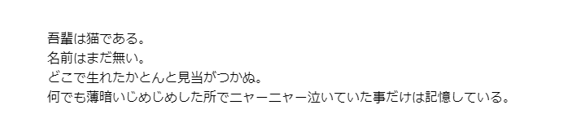

### 1-2

>吾輩は猫である。名前はまだ無い。どこで生れたかとんと見当がつかぬ。何でも薄暗いじめじめした所でニャーニャー泣いていた事だけは記憶している。

上記例文を使用し、図の通り「段落」を表示し表示すること。

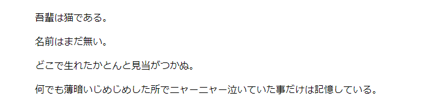

### 1-3

>吾輩は猫である。名前はまだ無い。どこで生れたかとんと見当がつかぬ。何でも薄暗いじめじめした所でニャーニャー泣いていた事だけは記憶している。

上記例文を使用し、図の通り「改行」を行い表示すること。

※その際 `
` タグの使用、タグの中にタグを記述することを禁ずる。

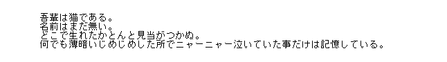

 

 

### 1-4

>吾輩は猫である。名前はまだ無い。

上記例文を使用し、図の通り一部を「太字」「打ち消し」で表示すること。

※太字には２種類の実装方法がある

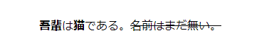

### 1-5

図の通り「リスト」を表示すること。

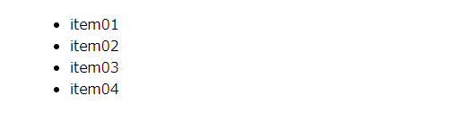

### 1-6

図の通り「複数段のリスト」を表示すること。

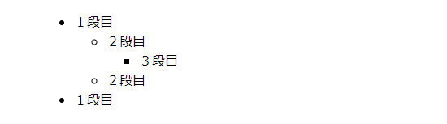

### 1-7

図の通り「番号付きリスト」を表示すること。

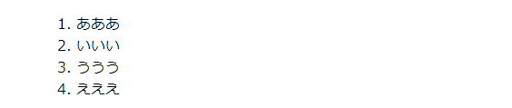

 

 

## 問2: テーブル

### 2-1

図の通り、表を表示すること。

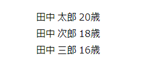

### 2-2

図の通り、表を表示すること。

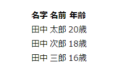

### 2-3

図の通り、表を表示すること。

※非推奨ではあるが、枠線の表示には `border=1` を指定すること。

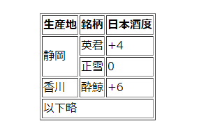

 

 

## 問3: 画像

### 3-1

`img` フォルダ内の画像 `fff.png` を使用し

図の通り、「絶対パス」を使用し画像をオリジナルサイズで表示すること。

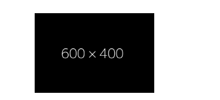

### 3-2

`img` フォルダ内の画像 `fff.png` を使用し

図の通り、「相対パス」を使用し

画像の横幅に「300px」を指定し、アスペクト比固定 (等倍) で表示すること。

### 3-3

存在しない画像のパスを指定し、図の通り「代替テキスト」を表示すること。

 

 

## 問4: リンク

### 4-1

図の通り `https://www.google.co.jp/` へ移動するリンクを表示すること。

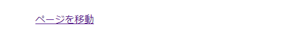

### 4-2

図の通り `https://www.yahoo.co.jp/` を「別ページで開く」リンクを表示すること。

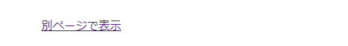

### 4-3

図の通り、「ページ内リンク」を表示すること。

※その際、移動先は `h1` タグとし、 `id` には `top` を指定すること。

 

 

## 問5: フォーム

### 5-1

図の通り、テキスト入力枠を表示すること。

その際、空欄時にヒントを表示させること。

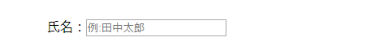

### 5-2

図の通り、テキスト入力枠を表示すること。

その際、入力文字列が伏せ字になるよう指定すること。

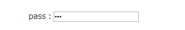

### 5-3

図の通り、以下の条件を満たすラジオボタンを表示すること。

* ボタン１つのみを選択可能にすること。
* ページ表示時に「ラジオ２」が選択された状態にすること。
* 「ラジオ１」「ラジオ２」の文字列をクリックしても選択状態にできること。

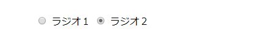

### 5-4

図の通り、以下の条件を満たすチェックボックスを表示すること。

* ページ表示時に「チェック２」が選択された状態にすること。
* 「チェック１」「チェック２」の文字列をクリックしても選択状態にできること。

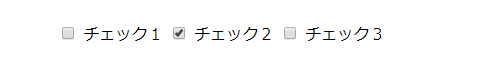

 

 

### 5-5

図の通り、３種類のボタンを表示すること。

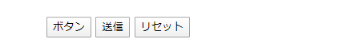

### 5-6

図の通り、セレクトボックスを作成すること。

その際、ページ表示時に「オプション２」が選択された状態にすること。

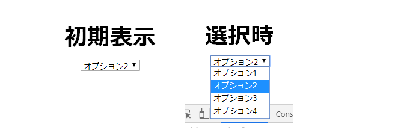