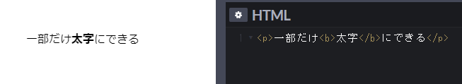
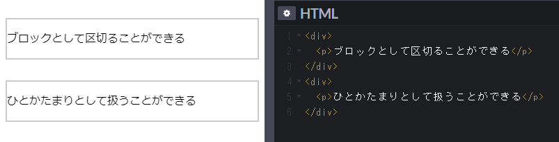
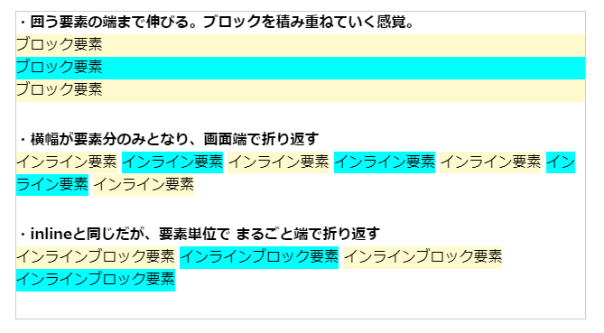
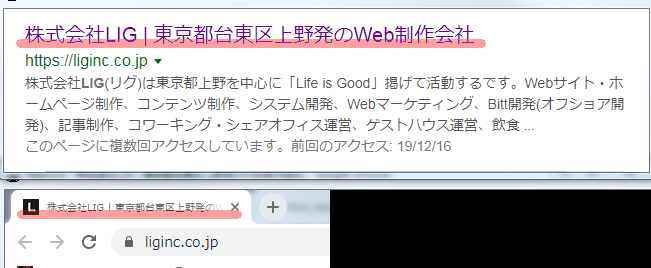
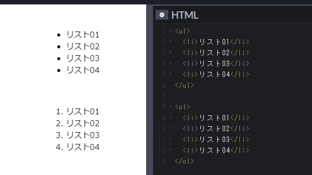
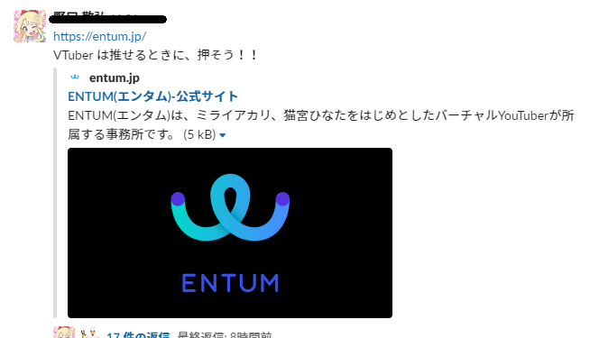

<!-- <link rel="stylesheet" href="https://cdnjs.cloudflare.com/ajax/libs/font-awesome/5.9.0/css/all.min.css" integrity="sha256-UzFD2WYH2U1dQpKDjjZK72VtPeWP50NoJjd26rnAdUI=" crossorigin="anonymous" /> -->

<link href="https://use.fontawesome.com/releases/v5.0.6/css/all.css" rel="stylesheet">

<style>
  /* h1 {
    position: absolute;
    top: 30%;
    left: 50%;
    transform: translate(-50%, -50%);

    text-align: center;
    font-size: 3.5rem;
    font-weight: bold;
  } */

  a::after {
      padding: 0 4px;
      content: "\f35d";
      font-family: "Font Awesome 5 Free";
      font-weight: 900;
      font-size: 0.8rem;
  }

  @media print {
    @page { margin: 0; }
    body { margin: 1.6cm; }
  }

  h2 {
    border-left: solid 6px #28a745;
    border-bottom: none!important;
    padding-left: 16px;
    height: 40px!important;
    line-height: 40px!important;
    font-weight: bold!important;
  }

  h3 {
    padding-left: -14px;
    border-bottom: dashed #ccc 1px;
  }

  h3:before {
    content: "■ ";
    color: #17a2b8;
  }

  th, td {
    border: solid 1px #666;
  }

  table {
    margin-bottom: 30px;
  }

  strong {
    color: #f66;
  }

  hr {
    margin-bottom: 30px;
    border-color: #ccc;
  }

  blockquote {
    background: none!important;
    /* font-style: italic; */
    color: #999;
  }
</style>

# html テキスト

## はじめに

本資料では、過去のバージョン (XHTML他) については特に触れないこととする。

ブラウザ「Google Chrome」のバージョン56 からは **標準が html5** となった他

最近の Web サイトは html5 が大前提なことが理由。

---

html を学習するにあたり、使用するブラウザは

[Google Chrome](https://www.google.com/intl/ja_jp/chrome/) または [Firefox](https://www.mozilla.org/ja/firefox/new/) をオススメする。

例に挙げた２つのブラウザは「モダンブラウザ」と呼ばれており

**最新の Web 技術をいち早く取り入れている** ことが理由。

逆に、流行を取り入れられず取り残されたモノを「レガシーブラウザ」と呼ぶらしい。

~~InternetExplorer は死んだ。もういない。~~

---

元も子もない話ではるが、正直なところ この資料を読むよりも

以下のサイトを読むことをオススメしたくなるほど完成度が高い。

[HTMLクイックリファレンス -HTMLの基本](http://www.htmq.com/htmlkihon/)

[MDN web docs -HTML を始めよう](https://developer.mozilla.org/ja/docs/Learn/HTML/Introduction_to_HTML/Getting_started)

---

本資料は筆者が上記サイトと経験を元に、必要であろう情報をまとめたものとなる。

**なお、本資料は「社外秘」とする。**

<br>
<div style="page-break-before:always"></div>
<br>

## html とは

HTML（HyperText Markup Language）のことであり

つまりは **ウェブサイトの構成をブラウザに伝えるマークアップ言語** である。

html ファイル内に「タグ」と呼ばれる要素を記述し

ブラウザに「記述された要素」が文章や画像であることを伝え、表示させる。

---

html は一般的に呼ばれる「プログラミング言語」ではない。

ただただ **ソースコードの上からタグを順番に読み、表示させるのみ** であり

計算や条件分岐といった処理を行うことはできない。

<br>
<div style="page-break-before:always"></div>
<br>

## html ファイルの作成方法

1. テキストエディタ上で「新規ファイル」を作成

1. 文字コード `utf-8` を指定する

1. 「最低限必要な要素」の HTML サンプルコードを貼り付ける (※1)

1. 新規テキストファイルの中で「貼り付け」、または「ペースト」

1. index.html という名前でファイルを保存 (※2)

(※1) VSCode を使っているならば `!` を入力後に `[Tab]` 押下でテンプレ生成も可 (Emmet)

(※2) 大事なのは `.html` という拡張子。index の部分は何でも構わない

---

## 最低限必要な要素

**html を書く上で最低限必要な要素** は以下の通りである。

```html
<!DOCTYPE html>
<html>
<head>
  <meta charset="utf-8">
  <title>ウェブページのタイトル</title>
</head>
<body>
  <p>本文</p>
</body>
</html>
```

### `<!DOCTYPE html>`

document type の略。

バージョンが html5 であることを示す以外、本項目について知る必要はない。

### `<html>`

このタグの内部が **ページ全体を構成する要素** となる。

### `<head>`

**サイトに関わる情報** (≠サイト上に載せる情報) を記述する領域。

例：文字コード指定、言語指定、サイトのタイトル

### `<body>`

**画面に表示したい要素** を記述する領域。

<div style="page-break-before:always"></div>
<br>

## 開始タグ・終了タグ

基本的にタグは「開始タグ」と「終了タグ」をセットで記述し

その間に載せたい情報を記述する。

例えば以下の通り。

```html
<p>←開始タグ...終了タグ→</p>
```

> ※終了タグにはスラッシュをつけること。

> ※例外的に `` タグのように終了タグの存在しない「空要素」が存在する。

---

## 入れ子構造

タグの中にタグを記述し、 **要素の一部分だけを装飾** したり

**親子関係のひとかたまり** を作ることができる。

### 例：一部のみ装飾



### 例：ブロック分け



<br>
<div style="page-break-before:always"></div>
<br>

## 属性とは

タグに **要素についての追加情報** を持たせることができる。

例えば以下の通り。

```html
<a href="http://google.co.jp">リンクに使われるタグ</a>
```

上記では `<a>` タグについて `href` 属性を記述し、リンクの飛び先を指定した。

---

## ブロックレベル・インライン・インラインブロック要素

各タグは それぞれ「ブロック要素」「インライン要素」でできている。

### ブロック要素 (p, div, table...)

**親要素の領域いっぱいまで横幅をとる。**

そのため、ブロック要素が連続すると下へ下へと要素が重なっていく。

### インライン要素 (a, img, span...)

インライン要素のタグ自体の要素分しか横幅を持たない。

インライン要素が連続する場合 **余った横幅に詰めて、横並びで表示** されるようになる。

### インラインブロック要素

例外的。インライン要素は文字が途中で折り返されてしまったが

インラインブロック要素を指定すると **タグ単位で折り返す** ようになる。



<div style="page-break-before:always"></div>
<br>

## 一般的なタグの解説・具体例 (head内)

### `<html>`

`<html>` タグ内に、ページを構成するタグを記述していく。

### `<head>`

`<head>` タグ内には `<meta>` タグや `<title>` タグ等

ページの情報に関するタグを記述する。

### `<title>`

本タグに記述したテキストは「検索結果」や「ウェブページのタイトル」として表示される。



### `<meta>`

サイトの説明、文字コード、検索ワードといった情報を載せる。

### `<style>`

主に CSS の記述、外部 CSS ファイルの読み込みを行う際に使う。

### `<script>`

主に javascrpit の記述、外部 javascript ファイルの読み込みを行う際に使う。

<br>
<div style="page-break-before:always"></div>
<br>

## ブロック要素のタグ

### `<body>`

`<body>` タグ内に「ページに表示したい要素」を記述する。

### `<h1> ～ <h6>`

> Header の h

通称「見出しタグ」。タグ内のテキストその他を表示する。

**数字が小さいほど優先度・重要度** が高い。

`<h1>` タグのみ **１ファイル内につき１つしか使ってはならない** 暗黙のルールが存在する。

というのも、「一番重要」が複数あったら「一番ってなんだよ」となるからである。

### `<p>`

> Paragraph の P。

テキストを表示する為のタグ。

`<p>` タグ１つで「１つの段落」となる。

### `<div>`

> DIVision の div。

表示には影響しないが、要素を囲うことにより１つの塊をつくることができる。

後ほど CSS を扱う際に大活躍する予定。乞うご期待。

### `<ul>` (`<ol>`), `<li>`

* User List の ul
* Order List の ol
* lIst の li。

リストを作成できる。

親要素に `<ul>` タグを使うと `<li>` タグの先頭に「・」が付き

`<ol>` タグを使うと `<li>` タグの先頭に数字が連番になるよう割り振られる。



<br>
<div style="page-break-before:always"></div>
<br>

## インライン要素のタグ

### `<a>`

> Anker の a

リンクになるテキストを表示する。

### `<span>`

主に `<p>` タグの中で使われる。

文字を部分的に装飾する目的で使われる場合が多い。


### ``

> IMaGe の img

ページ上に画像を表示できる。

<br>
<div style="page-break-before:always"></div>
<br>

## テーブル タグまわり

`<table>`

`<tbody>`

`<thead>`

`<th>`

`<tr>`

`<td>`

<br>
<div style="page-break-before:always"></div>
<br>

## フォーム タグまわり

`<form>`

`<input>` type="text"

`<input>` type="password"

`<input>` type="radio"

`<input>` type="checkbox"

`<input>` type="file"

`<input>` type="button"

`<input>` type="submit"

`<input>` type="reset"

`<input>` type=""

`<button>`

`<select>` と `<option>`

`<textarea>`

属性: readonly

属性: disabled

属性: placeholder

属性: autofocus

属性: checked

属性: selected

<br>
<div style="page-break-before:always"></div>
<br>

## その他タグ

`<b>`

`<i>`

`<em>`

`<strong>`

`<hr>`

`<small>`

`<br>`

`<pre>`

`<iframe>`

`<!--` と `-->`

## SEO とは

## 絶対パス・相対パス

## Emmet とは

<br>
<div style="page-break-before:always"></div>
<br>

## OGPタグとは

Open Graph protocol の略。

本タグを記述することにより、Twitter, Facebook, LINE, Slack 等の SNS で

URL を含めた投稿を行った際に **その投稿にサイトに関する情報を付与** できる。



### 実際のコード

```html
<meta name="twitter:card" content="summary_large_image">
<meta name="twitter:site" content="https://entum.jp/">
<meta name="twitter:title" content="ENTUM(エンタム)-公式サイト">
<meta name="twitter:description" content="ENTUM(エンタム)は、ミライアカリ、猫宮ひなたをはじめとしたバーチャルYouTuberが所属する事務所です。">
<meta name="twitter:image:src" content="https://entum.jp/entum_ogp.png">

<meta property="og:title" content="ENTUM(エンタム)-公式サイト">
<meta property="og:type" content="website">
<meta property="og:site_name" content="ENTUM(エンタム)-公式サイト">
<meta property="og:description" content="ENTUM(エンタム)は、ミライアカリ、猫宮ひなたをはじめとしたバーチャルYouTuberが所属する事務所です。">
<meta property="og:locale" content="ja_JP">
<meta property="og:url" content="https://entum.jp/">
<meta property="og:image" content="https://entum.jp/ogp.png">
```

> コードは [ENTUM(エンタム)](https://entum.jp) より引用

<br>
<div style="page-break-before:always"></div>
<br>

## オススメ参考サイト

### [HTMLクイックリファレンス](http://www.htmq.com/)

html のタグや CSS のプロパティについて辞書のように使えるサイト。

### [MDN web docs](https://developer.mozilla.org/ja/docs/Web/Reference)

Web 系 (html, css, javascript) に関する資料ならおまかせ！というほど情報が豊富。

※ただし少々堅苦しい印象を受ける。

### [コリス](https://coliss.com/)

毎日なにかしら Web に関する情報を載せてくれている。

最近はフォントやデザインの話がメイン。

### [Webクリエイターボックス](https://www.webcreatorbox.com/)

そこそこの更新頻度で Web についての記事を載せてくれている。

### [LIG](https://liginc.co.jp)

最近だと宣伝記事やネタ記事ばかりだが

稀に Web にまつわるチュートリアル記事を載せてくれる。

[CSS の Flex に関する記事](https://liginc.co.jp/web/html-css/css/21024) は秀逸。