# jQuery課題

## jQueryを使用して以下の課題を実装すること

なお、画像はexerciseImgフォルダに置いてある。

### 1. pタグの文字色をredに設定せよ。

#### 実行結果

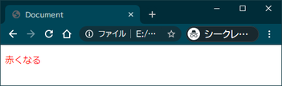

### 2. テキストボックスに入力した内容を、IDセレクタとクラスセレクタそれぞれを使用して表示せよ。

#### 実行結果

##### 入力前

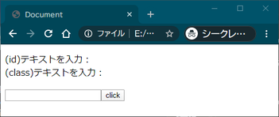

##### 入力後「click」ボタン押下

（上の要素はIDを設定、下の要素はクラスを設定して内容を書き換えている）

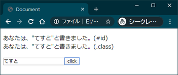

### 3. 一番目のli要素のみ背景色をredに設定せよ。

#### 実行結果

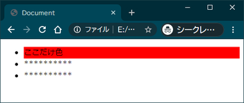

### 4. 画像をクリックすると縦横比（アスペクト比）を維持したまま横の長さを変更する処理を実装せよ。 長さは現在の画像の横の長さに+100pxになるようにすること。

#### 実行結果

##### 初期状態

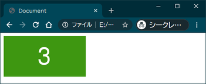

##### 1回クリック後

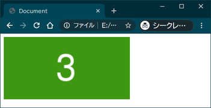

##### 2回クリック後

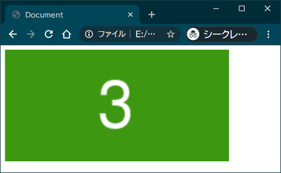

### 5. input要素にフォーカスするとinput要素の背景色をyellowに変更する処理を実装せよ。

#### 実行結果

##### 初期状態

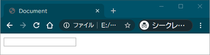

##### テキストボックスにフォーカス

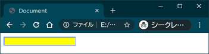

### 6. 表示されている画像をクリックするとhide()で非表示になり、「TEST」の文字をクリックするとshow()で画像を表示する処理を実装せよ。

#### 実行結果

##### 初期状態

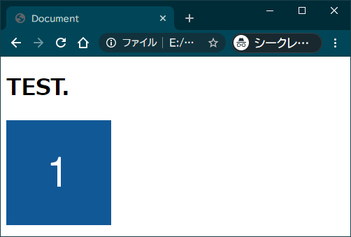

##### 画像クリック

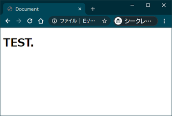

##### 画像クリック後文字クリック

### 7. pタグをクリックすると「width: 400px, font-size: 24px, opacity: 0.1」の設定にアニメーションするようにせよ。 アニメーションの速度は3000msとする。

#### 実行結果

##### 初期状態

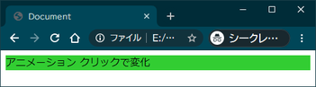

##### アニメーション終了

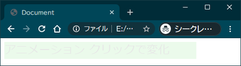

### 8. クリックしたa要素に応じた画像を表示する処理を実装せよ。

#### 実行結果

##### 初期状態/画像1をクリック

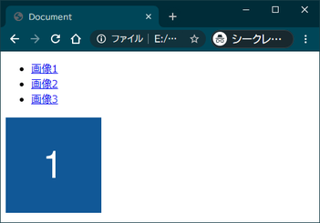

##### 画像2をクリック

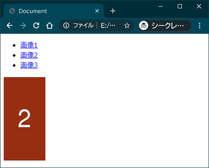

##### 画像3をクリック

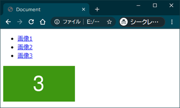

### 9. テキストボックスから入力された文字と背景色を設定した要素をdiv要素にappendで追加せよ。 要素は入力される度に追加されていく。

参考：[ブラウザで名前が定義されている色名一覧](https://www.colordic.org/)

#### 実行結果

##### 初期状態
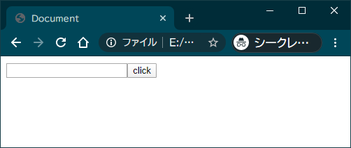

##### redと入力してボタン押下

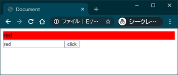

##### その後yellowと入力してボタン押下

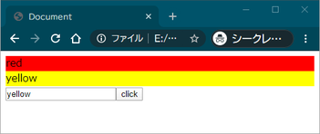

##### その後greenと入力してボタン押下

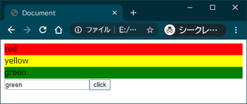
