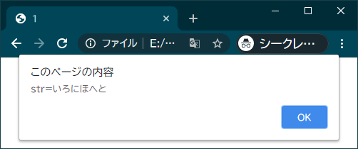
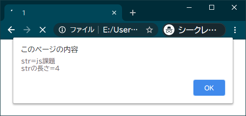
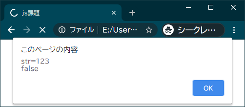
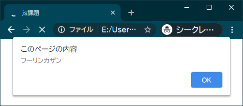
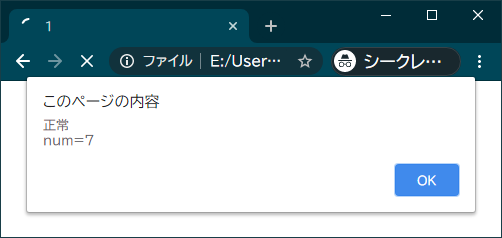
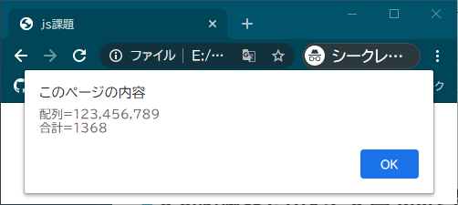
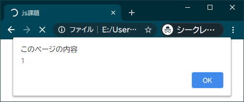
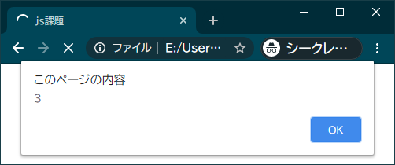
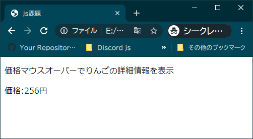
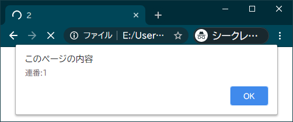

# JavaScript 課題

## 1. 文字列操作

### 1-1. 変数 str に「いろ」という文字列を代入した後、str に文字列「はにほへと」を結合して「いろはにほへと」と表示せよ。 なお、文字列操作関数は使用しない。

#### 実行結果

### 1-2. 変数 str に任意の文字列を代入し、その後その文字列の長さを表示せよ。

#### 実行結果

##### strに「js課題」を代入した場合

## 2. 正規表現

### 2-1. 変数 str に任意の文字列を代入し、正規表現を用いて半角数字のみの文字列なら「true」、それ以外なら「false」と表示せよ。 なお、制御文は使用しない。

#### 実行結果

##### str に「１２３」と代入した場合

alert の表記では全角半角の区別がつかないがこちらは全角

##### str に「321」と代入した場合

### 2-2. 変数 tanukiCryptic に「タタフータリタンタカタタザンタ」という文字列を代入する。正規表現を用いて「タ」を除いた文字列を表示せよ。

ヒント：「js 　正規表現　フラグ　グローバル」

#### 実行結果

## 3. 制御文

### 3-1. 変数 num に任意の数値を代入し、制御文を用いて num が 1 ～ 10 の場合は「正常」それ以外は「エラー」と 表示せよ。

#### 実行結果

##### num に 7 を代入した場合

##### num に-4 を代入した場合

### 3-2. 数字が入った任意の配列 arr を宣言し、制御文を用いて配列の各要素の和を表示せよ。

※今回は Array.prototype.reduce()以外で実装すること。

#### 実行結果

##### [123, 456, 789]の配列の場合

### 3-3. 制御文を用い、alert を 3 回表示するたびに 1 ～ 3 まで数字が増えていくようにせよ。

#### 実行結果

##### 1 回目

##### 2 回目

##### 3 回目

### 3-4. 制御文を用い、alert 5 回を表示するたびに奇数か偶数かを表示せよ。

#### 実行結果

##### 1 回目

##### 2 回目

##### 3 回目

##### 4 回目

##### 5 回目

## 4. 関数

### 4.1. 問 3-1 の判定処理を関数化し、関数 isError を作成せよ。

#### 関数仕様

* 引数は 1 つで数値を受け取る。
* エラーなら「true」、正常なら「false」を返す。

### 4-2. 問 3-2 の配列の総和を計算する処理を関数化し、関数 arrSum を作成せよ。

#### 関数仕様

* 引数は 1 つで配列を受け取る。
* 配列の合計値を返す。

### 4-3. 入力された金額に応じた消費税を返却する関数 calcTax を作成せよ。 その後変数 price に任意の金額を代入し、税込みの金額を表示せよ。

#### 関数仕様

* 引数は 1 つで金額を受け取る。
* 税率 10%とし小数点以下は切り捨てとする。
* 税込金額を返す。

#### 実行結果

##### calcTax(price)、price が 123 の場合。

## 5. DOM 操作とフォーム

### 5-1. 問 4-3 を改造し、価格の入力をテキストボックスから行い、「計算」ボタンを押下することで税込み金額が表示されるようにせよ。

### 5-2.りんごの詳細情報を画面に表示する関数を外部ファイルに作成せよ。

#### 詳細

* 関数名は任意。
* 作成するファイル名は 「script.js」。
* 配置場所は「js」 フォルダ。
* html ファイルから読み込む。
* 詳細情報の切り替えは「価格:256 円」の**テキストに**マウスカーソルが乗っているか否か。
* 価格がある行（テキストがない場所）にマウスカーソルが乗っている場合は詳細表示しない。

ヒント：「js 　マウスイベント　表示　切り替え」、関数は 2 つ必要

#### 実行結果

##### 価格のテキストにカーソルが乗っていない場合

##### 価格のテキストにカーソルが乗っている場合

### 5-3. 入力された数値までの連番がカンマ区切りで表示される関数を外部ファイルに作成せよ。

#### 詳細

* 外部 js ファイルは問 5-2 と同じでよい。
* 入力された回数だけ alert を表示し、そのたびに連番が増えていく。
* 最後の数の後ろにはコンマを表示しない。

※今回は Array.prototype.join()以外で実装すること。

ヒント：問 3-3 の応用、問 4-2 とほぼ同じ構造

#### 実行結果（5 回の場合）

##### 1 回目

##### 2 回目

##### 3 回目

##### 4 回目

##### 5 回目

### 5-4. 問 5-3 を改造し、入力された値が半角数字かどうか判定し、それ以外なら「数値を正しく入力してください」と表示するようにせよ。

ヒント：半角数字の判定は問 2-1 と同じ
