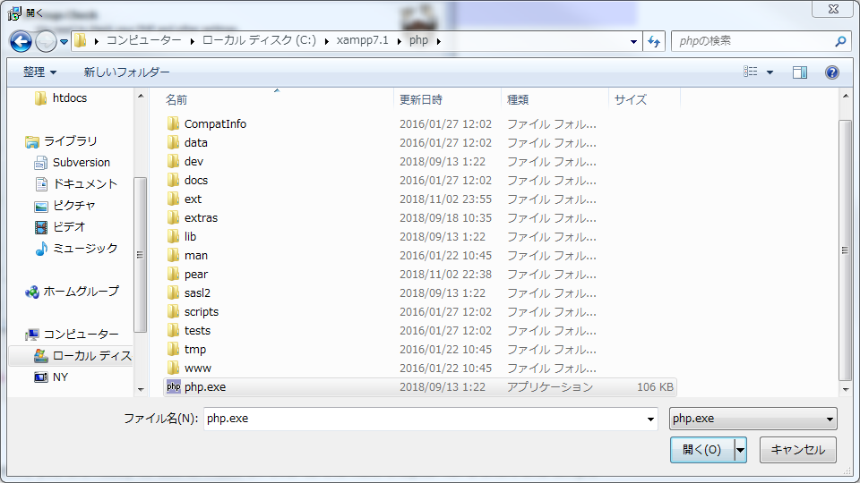
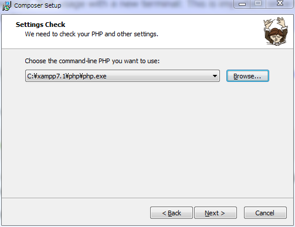
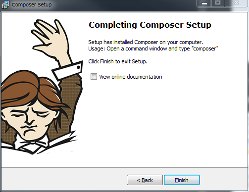

<!-- <link rel="stylesheet" href="https://cdnjs.cloudflare.com/ajax/libs/font-awesome/5.9.0/css/all.min.css" integrity="sha256-UzFD2WYH2U1dQpKDjjZK72VtPeWP50NoJjd26rnAdUI=" crossorigin="anonymous" /> -->

<link href="https://use.fontawesome.com/releases/v5.0.6/css/all.css" rel="stylesheet">

<style>
  /* h1 {
    position: absolute;
    top: 30%;
    left: 50%;
    transform: translate(-50%, -50%);

    text-align: center;
    font-size: 3.5rem;
    font-weight: bold;
  } */

  a::after {
      padding: 0 4px;
      content: "\f35d";
      font-family: "Font Awesome 5 Free";
      font-weight: 900;
      font-size: 0.8rem;
  }

  @media print {
    @page { margin: 0; }
    body { margin: 1.6cm; }
  }

  h2 {
    border-left: solid 6px #28a745;
    border-bottom: none!important;
    padding-left: 16px;
    height: 40px!important;
    line-height: 40px!important;
    font-weight: bold!important;
  }

  h3 {
    padding-left: -14px;
    border-bottom: dashed #ccc 1px;
  }

  h3:before {
    content: "■ ";
    color: #17a2b8;
  }

  th, td {
    border: solid 1px #666;
  }

  table {
    margin-bottom: 30px;
  }

  strong {
    color: #f66;
  }

  hr {
    margin-bottom: 30px;
    border-color: #ccc;
  }

  blockquote {
    background: none!important;
    /* font-style: italic; */
    color: #999;
  }
</style>

# Laravel 資料1　環境構築とページ作成

## 0. はじめに

本資料は以下の内容について書かれている。

1. Composer の導入
1. Laravel プロジェクトの作成
1. login ページの作成

### 注意

XAMPP は **PHP のバージョン** が **7.x 系列** の物を使用すること。

また、XAMPP のパスは著者の環境に依存している為

それぞれの環境に合わせて修正すること。

<br>
<div style="page-break-before:always"></div>
<br>


## 1. Composer のインストール

[composer公式](https://getcomposer.org/)

**Getting Started** から飛ぶ


[Windows用インストーラリンク](https://getcomposer.org/doc/00-intro.md#installation-windows)

**Composer-Setup.exe** をクリックし、インストーラをダウンロードし、実行する。


<br>
<div style="page-break-before:always"></div>
<br>

### ステップ１

チェックはせず、次へ。

※チェックするとインストール時に「アンインストール用ファイル」が含まれなくなる


### ステップ２

今回使う予定の XAMPP 内の php.exe を選択し、次へ。

<!--  -->

<!--  -->


<br>
<div style="page-break-before:always"></div>
<br>

### ステップ３

プロキシ設定。無視して次へ。


### ステップ４

「Install」からインストールを開始する。


<br>
<div style="page-break-before:always"></div>
<br>

### ステップ５

インストール完了。





<br>
<div style="page-break-before:always"></div>
<br>


## Laravel プロジェクトの作成

XAMPP の `htdocs` 内に Laravel のプロジェクトを作成する。

### shell の起動

XAMPP を起動し、図のボタンから shell を起動する。


<br>
<div style="page-break-before:always"></div>
<br>

### プロジェクトの作成

起動後は `C\xampp` から始まるため

以下のコマンドで `C\xampp\htdocs` フォルダへ移動。

```bash
cd htdocs
```

移動を確認後、以下のコマンドを実行する。

```bash
composer create-project "laravel/laravel=5.4.*" LaravelSample
```

※今回使用する Laravel のバージョンは 5.4 とする


`Application key set successfully.` と出たら完了。

<br>
<div style="page-break-before:always"></div>
<br>

XAMPP の htdocs をエクスプローラから確認すると、フォルダが作成されている。


<br>
<div style="page-break-before:always"></div>
<br>

### サーバーの起動

shell で以下のコマンドを実行し、プロジェクトフォルダへ移動する。

```bash
cd c:\xampp\htdocs\LaravelSample
```

移動を確認後、以下のコマンドを実行しサーバーを起動する。

```bash
php artisan serve
```

shell 上に `Laravel development server started: <http://127.0.0.1:8000>` と表示された後

ブラウザにて [http://localhost:8000](http://localhost:8000) を開き

以下の画面が表示されたらOK。


### サーバーの停止

サーバーを止める際には shell を閉じればOK。

<br>
<div style="page-break-before:always"></div>
<br>

## ログイン画面の作成

ブラウザ上で `localhost:8000/login` と叩いた際にログイン画面が出るよう

以下の流れでログイン画面のトップページを表示させる。

1. ルーティングに関わる web.php を編集する
1. 項目１にて「web.php にて呼んだコントローラー名」でコントローラーを作成
1. 画面表示用にView ファイル (拡張子 .blade.php ) を作成

新たなページを作る際には、上記の流れを再度行うことになる。

<br>
<div style="page-break-before:always"></div>
<br>

## ルーティングの編集

`routes/web.php` を編集する。

```php
Route::get('/login', 'LoginController@getIndex');
```

本ルーティングファイルは「どのメソッドで」「どのURL (URI) が叩かれたら」

「どのコントローラの」「どの関数を呼ぶか」を指定する。

今回の場合は「GET メソッドで」「/login にアクセスした場合」

「LoginController.php 内の」「getIndex() 関数を呼ぶ」という意味になる。

---

もちろん「呼ぼうとしているファイルが存在しない」とエラーを吐くため

これから順番に作成していくことになる。

---

ちなみに URL から直接ページを開く際には `Route::get()` を使い

フォームの値の受け渡しの際には `Route::post()` を使う。

<br>
<div style="page-break-before:always"></div>
<br>

## コントローラーの生成

本項目ではコマンドライン上から「LoginController.php」ファイルを生成する。

### プロジェクトフォルダへ移動

shell を起動し `cd c:\xampp\htdocs\LaravelSample` を実行し

プロジェクトフォルダへ移動する。

### LoginController の生成

移動後、以下のコマンドを実行。

```bash
php artisan make:controller LoginController
```

実行後、`Controller created successfully.` と出たらOK.

<br>
<div style="page-break-before:always"></div>
<br>

### ファイルの確認

`C:\xampp\htdocs\LaravelSample\app\Http\Controllers` を開くと

以下の通り、コントローラーファイルが生成されている。


<br>
<div style="page-break-before:always"></div>
<br>


### LoginController の編集

ファイルの作成に成功したら、 web.php にて記述した関数

`getIndex()` を作成する。

【app\Http\Controllers\LoginController.php】

```php
<?php

namespace App\Http\Controllers;

use Illuminate\Http\Request;

class LoginController extends Controller
{
    function getIndex() {
        // view ファイルを返却
        return view('login/login');
    }
}
```

<br>
<div style="page-break-before:always"></div>
<br>

## テンプレートファイルの作成

[公式リンク](https://readouble.com/laravel/5.5/ja/blade.html)

Blade (ブレード) という Laravel 固有のテンプレートエンジンを利用し

拡張子 `.blade.php` ファイルを動かす。内容は html + php。

MVC の V ... View にあたる。

<br>
<div style="page-break-before:always"></div>
<br>

### layout.blade.php の作成

以下の通り、テンプレとなる view ファイルを作成する。

配置場所は `LaravelSample/resources/views/layout` の中。

※layout フォルダは自分で作成すること。

【layout.blade.php】

```html
<!doctype html>
<html lang="ja">

<head>
  <meta http-equiv="Content-Type" content="text/html;charset=UTF-8">
  {{-- jQuery読み込み --}}
  <script
  src="https://code.jquery.com/jquery-3.4.1.slim.min.js"
  integrity="sha256-pasqAKBDmFT4eHoN2ndd6lN370kFiGUFyTiUHWhU7k8="
  crossorigin="anonymous"></script>
  
  {{-- bootstrap4読み込み --}}
  <link href="https://stackpath.bootstrapcdn.com/bootstrap/4.4.1/css/bootstrap.min.css" rel="stylesheet" integrity="sha384-Vkoo8x4CGsO3+Hhxv8T/Q5PaXtkKtu6ug5TOeNV6gBiFeWPGFN9MuhOf23Q9Ifjh" crossorigin="anonymous">
  <script src="https://stackpath.bootstrapcdn.com/bootstrap/4.4.1/js/bootstrap.min.js" integrity="sha384-wfSDF2E50Y2D1uUdj0O3uMBJnjuUD4Ih7YwaYd1iqfktj0Uod8GCExl3Og8ifwB6" crossorigin="anonymous"></script>
  <script src="https://stackpath.bootstrapcdn.com/bootstrap/4.4.1/js/bootstrap.bundle.min.js" integrity="sha384-6khuMg9gaYr5AxOqhkVIODVIvm9ynTT5J4V1cfthmT+emCG6yVmEZsRHdxlotUnm" crossorigin="anonymous"></script>

  <script>
    {{--@yield('script')--}}
  </script>
</head>

<body>
  
  <div class="container">
    @yield('content')
  </div>
</body>
</html>
```

<br>
<div style="page-break-before:always"></div>
<br>

### login.blade.php の作成

配置場所は `LaravelSample/resources/views/login` の中。

※login フォルダは自分で作成すること。

【login.blade.php】

```html
@extends('layout/layout')
@section('content')
<form method="post" action="/login">
  <h2>ログイン</h2>
  {{ csrf_field() }}
  <label>名前</label>
  <div class="form-group">
    <input type="text" name="name" class="form-control">
  </div>
  <label>パスワード</label>
  <div class="form-group ">
    <input type="password" name="password" class="form-control">
  </div>
  <label>権限</label>
  <div class="form-group">
    <div class="radio-inline">
      <label>
        <input type="radio" name="authority" value="1">管理者
      </label>
    </div>
    <div class="radio-inline">
      <label>
        <input type="radio" name="authority" value="2">⼀般
      </label>
    </div>
  </div>
  <br>
  <input type="submit" value="ログイン" class="btn btn-primary">
</form>
@stop
```

<br>
<div style="page-break-before:always"></div>
<br>

## 画面を確認

ロゴ画像がリンク切れしているが、表示には成功した。


