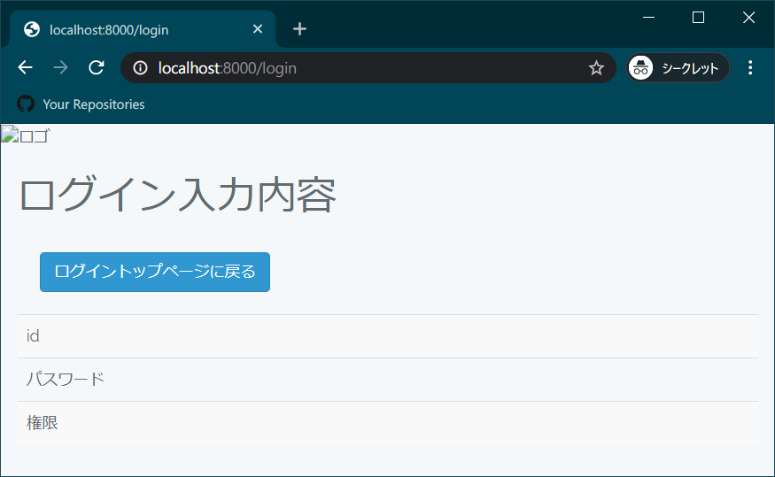
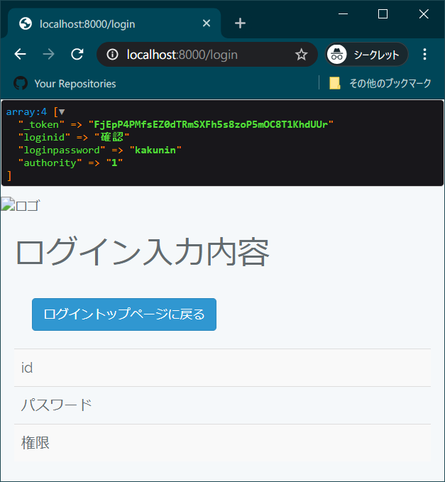
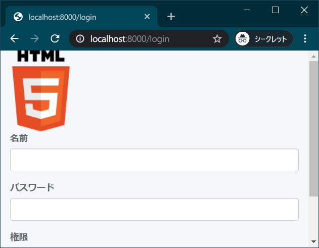

<link href="https://use.fontawesome.com/releases/v5.0.6/css/all.css" rel="stylesheet">
<style>
  a::after {
    padding: 0 4px;
    content: "\f35d";
    font-family: "Font Awesome 5 Free";
    font-weight: 900;
    font-size: 0.8rem;
  }
  @media print {
    @page { margin: 0; }
    body { margin: 1.6cm; }
  }
  h2 {
    border-left: solid 6px #28a745;
    border-bottom: none!important;
    padding-left: 16px;
    height: 40px!important;
    line-height: 40px!important;
    font-weight: bold!important;
  }
  h3 {
    padding-left: -14px;
    border-bottom: dashed #ccc 1px;
  }
  h3:before {
    content: "■ ";
    color: #17a2b8;
  }
  th, td {
    border: solid 1px #666;
  }
  table {
    margin-bottom: 30px;
  }
  strong {
    color: #f66;
  }
  hr {
    margin-bottom: 30px;
    border-color: #ccc;
  }
  blockquote {
    background: none!important;
    /* font-style: italic; */
    color: #999;
  }
</style>

# Laravel 資料 2 　リクエストの受渡し

## ログイン結果ページの作成

資料 1 に引き続き、今回はログイントップページで入力された内容を表示する画面を作成する。  
作成の流れはログイントップページを作成した際と同様である。  
本資料ではログイン結果ページに以下の機能を実装するまでを説明する。

- ログイントップページで入力されたリクエストを受け取る
- リクエストからパラメータを取り出す
- 受け取ったパラメータをログイン結果ページのビューに渡し表示する

今回は段階的にログイン結果ページの実装を行っていく。

<div class="page"></div>

## ルーティング設定～ビューの表示確認

### ルーティング設定

`routes/web.php` に以下を追記。

```php
Route::post('/login', 'LoginController@postIndex');
```

---

ログイントップページへのルーティングと見比べてみると以下の点が異なっている

```php
Route::get('/login', 'LoginController@getIndex');
Route::post('/login', 'LoginController@postIndex');
```

- `Route::`の後が**post**
- @以降で指定している関数が違う

指定している URL は同じだが、HTTP メソッド（get / post）で振り分けられるため問題ない。  
<br>
なお、HTTP メソッド名と「～@〇〇 Index」の〇〇が対応しているが、全く関係ない名前でも構わない。  
例えば「Route::**get**('/login', 'LoginController@**post**Index');」と書いても、非常に紛らわしいが動作する。

---

### postIndex メソッドの作成

postIndex メソッドを作成する。  
現時点では getIndex()と名前と View 以外全く同じである。

【app\Http\Controllers\LoginController.php】

```php
public function postIndex()
{
  // view ファイルを返却
  return view('login/result');
}

```

<div class="page"></div>

### result.blade.php の作成

`login.blade.php`と同じく`LaravelSample/resources/views/login` に`result.blade.php`を作成する。

`{{-- --}}`で囲まれた部分はコメントである。blede の場合はこう記述する。

【resources\views\login\result.blade.php】

```html
@extends('layout/layout') @section('content')
<h1>ログイン入力内容</h1>
<div class="row">
  <div class="col-sm-12">
    <a href="/login" class="btn btn-primary" style="margin:20px;">
      ログイントップページに戻る
    </a>
  </div>
</div>

<table class="table table-striped">
  <tr>
    <td>id</td>
    <td>
      {{-- ここにpostIndex()から渡されたデータが入る --}}
    </td>
  </tr>
  <tr>
    <td>パスワード</td>
    <td>
      {{-- ここにpostIndex()から渡されたデータが入る --}}
    </td>
  </tr>
  <tr>
    <td>権限</td>
    <td>
      {{-- ここにpostIndex()から渡されたデータが入る --}}
    </td>
  </tr>
</table>

@stop
```

<div class="page"></div>

### 画面を確認

ここで一旦、動作するか確認しておく。

[ログイントップページ](http://localhost:8000/login)にアクセスした後、ログインボタンを押下してログイン結果ページに遷移する。


<div class="page"></div>

## リクエストパラメータ取得

### postIndex メソッドの編集

ログイントップページから送られてきたリクエストを受け取り、リクエストパラメータを取得するように変更する。 -が付いている行が変更前、+が付いている行が変更後である。

【app\Http\Controllers\LoginController.php】

```diff
-public function postIndex()
+public function postIndex(Request $request)
 {
+  // リクエストパラメータを配列として全件取得
+  $input = $request->all();
+  dump($input);
  // view ファイルを返却
   return view('login/result');
 }
```

リクエストを受け取るには、単純にメソッドの引数に Request クラスの引数を追加すればよい。
資料通りに写していれば問題ないだろうが、`use Illuminate\Http\Request;`を忘れていた場合 ReflectionException になる。

#### \$request->all()

Request クラスの all メソッドはリクエストパラメータを全件配列として返却する。

#### dump()

var_dump()のような機能を持つ Laravel が用意している関数。  
色がついたり配列の開閉ができたりして var_dump()より使いやすい。

### （補足）要素を指定して入力データを取得
以下のようにビューのinputタグで付けたnameを指定することで、その値のみを取得することもできる。

```php
$request->input('name');
```

<div class="page"></div>

### 画面を確認

再び画面で確認する。

[ログイントップページ](http://localhost:8000/login)にアクセスした後、適当になにか入力してログインボタンを押下する。

dump()が上部に\$input の中身を出力している。入力した通りのデータが出力されていれば問題ない。

"\_token"には見覚えがないかもしれないが、これは CSRF トークンで、ログイントップページのビューの form タグ内にある`{{ csrf_field() }}`が生成している。  
Laravel はフォームでデータを送信する場合、必ず CSRF トークンを使うよう定めているため、書かなかったらエラーになる。覚えておくこと。



<div class="page"></div>

## コントローラからビューに値を渡す

### postIndex メソッドの編集

前項でデータが受け取れていることまでは確認した。  
確認が終わったため、dump()を書いた行は消すなりコメント化するなりしておく。

あとはビューにデータを渡すだけである。  
ビューにデータを渡す方法には 3 通りの方法がある。好きな方法で実装するとよい。  
それぞれ書き方と、ソースの変更箇所を示す。

#### 1.view()第 2 引数に連想配列として渡す

書き方

```php
public function test () {

  $iroha = '色は';
  $nihoheto = '匂へと';

  return view('ビュー', [
    'test1' => $iroha,
    'test2' => $nihoheto
  ]);
}
```

<br>
postIndex()の編集

【app\Http\Controllers\LoginController.php】

```diff
 public function postIndex(Request $request)
 {
   // リクエストパラメータを配列として全件取得
   $input = $request->all();
-  dump($input);
  // view ファイルを返却
-  return view('login/result');
+  return view('login/result', ['input' => $input]);
 }
```

<div class="page"></div>

#### 2.view()第 2 引数に compact 関数で渡す

書き方

```php
public function test () {

  $iroha = '色は';
  $nihoheto = '匂へと';

  // 変数ではなく変数名を文字列として渡していることに注意
  return view('ビュー', compact('iroha', 'nihoheto'));
}
```

<br>
postIndex()の編集

【app\Http\Controllers\LoginController.php】

```diff
 public function postIndex(Request $request)
 {
   // リクエストパラメータを配列として全件取得
   $input = $request->all();
-  dump($input);
  // view ファイルを返却
-  return view('login/result');
+  return view('login/result', compact('input'));
 }
```

<div class="page"></div>

#### 3.view()の with メソッドで渡す

書き方

```php
public function test () {

  $iroha = '色は';
  $nihoheto = '匂へと';

  return view('ビュー')->with([
    'test1' => $iroha,
    'test2' => $nihoheto'
  ]);
}
```

<br>
postIndex()の編集

【app\Http\Controllers\LoginController.php】

```diff
 public function postIndex(Request $request)
 {
   // リクエストパラメータを配列として全件取得
   $input = $request->all();
-  dump($input);
  // view ファイルを返却
-  return view('login/result');
+  return view('login/result')->with('input', $input);
 }
```
<div class="page"></div>

### result.blade.php の編集

コントローラから渡されたデータを表示するように変更する。

【resources\views\login\result.blade.php】

```diff
（略）
 <tr>
   <td>名前</td>
   <td>
-    {{-- ここにpostIndex()から渡されたデータが入る --}}
+    {{ $input['name'] }}
   </td>
 </tr>
 <tr>
   <td>パスワード</td>
   <td>
-    {{-- ここにpostIndex()から渡されたデータが入る --}}
+    {{ $input['password'] }}
   </td>
 </tr>
 <tr>
   <td>権限</td>
   <td>
-    {{-- ここにpostIndex()から渡されたデータが入る --}}
+    @if(empty($input['authority']))未選択
+    @elseif($input['authority'] === '1')管理者
+    @elseif($input['authority'] === '2')一般
+    @endif
   </td>
 </tr>
（略）
```

コントローラからはどの方法でも`$input`という変数（中身も`$input`）で渡されて来ている。

`{{ 変数 }}`は`<?php echo htmlspecialchars(変数) ?>`と同じ動作をする。  
\$\_POST の場合と同じく、ログイントップページのフォームの name 要素で設定した名前と同じキーで値が格納されているため、`{{ }}`内に書くことで値を表示することができる。

blade には制御構文も用意されおり、権限の表示では if 文を使って表示する文字列を変えている。
<div class="page"></div>

## 資料最終段階のソースコード

### 【app\Http\Controllers\LoginController.php】

```php
<?php

namespace App\Http\Controllers;

use Illuminate\Http\Request;

class LoginController extends Controller
{
  public function getIndex()
  {
    // view ファイルを返却
    return view('login/login');
  }

  public function postIndex(Request $request)
  {
    // リクエストパラメータを配列として全件取得
    $input = $request->all();

    // 好きな方法でViewに値を渡す
    // return view('login/result', ['input' => $input]);
    // return view('login/result', compact('input'));
    return view('login/result')->with('input', $input);
  }
}
```
<div class="page"></div>

### 【resources\views\login\result.blade.php】

```html
@extends('layout/layout') @section('content')
<h1>ログイン入力内容</h1>
<div class="row">
  <div class="col-sm-12">
    <a href="/login" class="btn btn-primary" style="margin:20px;">
      ログイントップページに戻る
    </a>
  </div>
</div>

<table class="table table-striped">
  <tr>
    <td>名前</td>
    <td>
      {{ $input['name'] }}
    </td>
  </tr>
  <tr>
    <td>パスワード</td>
    <td>
      {{ $input['password'] }}
    </td>
  </tr>
  <tr>
    <td>権限</td>
    <td>
      @if(empty($input['authority']))未選択
      @elseif($input['authority'] === '1')管理者
      @elseif($input['authority'] === '2')一般
      @endif
    </td>
  </tr>
</table>


@stop
```
<!-- フォーマットすると@if以下の表示が崩れるので気をつける -->

<div class="page"></div>

## 付録　ロゴ画像を設定する

ロゴ画像を設定しているのは以下の箇所である。

【layout.blade.php】

```html

```
asset()はpublicフォルダのパスを返す。  
resources下にassetsフォルダが存在するが関係ないようだ。

ビュー側で指定している通りにpublicフォルダに新たにimgフォルダを作成し、そこにhtml5b.pngという画像を配置すればロゴ画像が表示される。

画像は[W3C公式](https://www.w3.org/html/logo/#downloads)からダウンロードするとよい。


位置調整は必要だが、ロゴ画像が表示された。

<div class="page"></div>

## 付録　よく見がちなエラーと対処

とりあえずエラー文を翻訳すれば概ねどんなエラーであるかは分かる。  
あとエラー文で検索すれば大抵解決方法が出てくる。

### このサイトにアクセスできません

> localhost で接続が拒否されました。

web サーバが起動していない。

Laravel は XAMPP の Apache ではなく Laravel の web サーバを起動しないと動かない。  
`php artisan serve`した shell は閉じずに置いておくこと。  
閉じたらサーバも終了する。

### MethodNotAllowedHttpException

ルーティングに該当する URL が存在しない。  
`web.php`のルーティングの設定が正しくできているか確認してみる。

### ReflectionException

> Class App\Http\Controllers\Request does not exist

クラスが見つからない。

上の例では Request クラスが見つからないというエラー。  
use でクラスが存在する場所を設定する。
