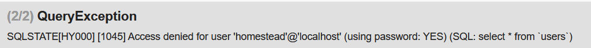
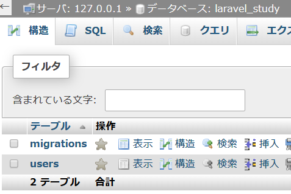
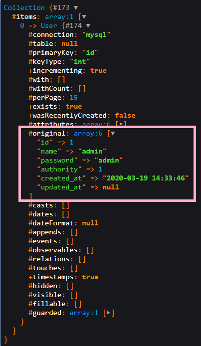

<link href="https://use.fontawesome.com/releases/v5.0.6/css/all.css" rel="stylesheet">
<style>
  a::after {
    padding: 0 4px;
    content: "\f35d";
    font-family: "Font Awesome 5 Free";
    font-weight: 900;
    font-size: 0.8rem;
  }
  @media print {
    @page { margin: 0; }
    body { margin: 1.6cm; }
  }
  h2 {
    border-left: solid 6px #28a745;
    border-bottom: none!important;
    padding-left: 16px;
    height: 40px!important;
    line-height: 40px!important;
    font-weight: bold!important;
  }
  h3 {
    padding-left: -14px;
    border-bottom: dashed #ccc 1px;
  }
  h3:before {
    content: "■ ";
    color: #17a2b8;
  }
  th, td {
    border: solid 1px #666;
  }
  table {
    margin-bottom: 30px;
  }
  strong {
    color: #f66;
  }
  hr {
    margin-bottom: 30px;
    border-color: #ccc;
  }
  blockquote {
    background: none!important;
    /* font-style: italic; */
    color: #999;
  }
</style>

# Laravel 資料 3 　 DB 連携

## 導入

本資料では Laravel での DB 連携について、資料 2 で作成したログインページにログイン機能を段階的に実装しながら説明を行う。

以下の手順で行っていく。

1. DB 作成
1. Laravel の DB 設定
1. モデルの作成
1. マイグレーションによるテーブル作成
1. ログイン機能の実装
1. 命名規則
1. 名前空間

## DB の作成

「laravel_study」という DB を作成する。

今回は Laravel に用意されているマイグレーション（後述）という機能を利用してテーブルを作成するため、作成するのは DB のみでよい。

<div class="page"></div>

## DB 設定の編集

Laravel で DB と接続するためには、`config/database.php`と`.env`、2 つの設定ファイルを編集する必要がある。  
本研修では MySQL を使用するため、MySQL に関する箇所を変更する。

-が付いている行が変更前、+が付いている行が変更後である。

### database.php の編集

【config/database.php】

```diff
 'mysql' => [
   'driver' => 'mysql',
   'host' => env('DB_HOST', '127.0.0.1'),
   'port' => env('DB_PORT', '3306'),
-  'database' => env('DB_DATABASE', 'forge'),
+  'database' => env('DB_DATABASE', 'laravel_study'),
-  'username' => env('DB_USERNAME', 'forge'),
+  'username' => env('DB_USERNAME', 'root'),
   'password' => env('DB_PASSWORD', ''),
   'unix_socket' => env('DB_SOCKET', ''),
   'charset' => 'utf8mb4',
   'collation' => 'utf8mb4_unicode_ci',
   'prefix' => '',
   'prefix_indexes' => true,
   'strict' => true,
   'engine' => null,
 ],
```

### .env の編集

【.env】

```
  DB_CONNECTION=mysql
  DB_HOST=127.0.0.1
  DB_PORT=3306
- DB_DATABASE=homestead
+ DB_DATABASE=laravel_study
- DB_USERNAME=homestead
+ DB_USERNAME=root
- DB_PASSWORD=secret
+ DB_PASSWORD=
```

<div class="page"></div>

### 注意点

DB 設定の編集中も Laravel の web サーバが機動中の場合、そのままでは編集した結果が反映されない。

一度停止させてから再び`php artisan serve`で起動させること。  
これを忘れた場合、動作確認のタイミングで以下のようなエラーを見ることになる。



<div class="page"></div>

## モデルの作成

Laravel ではコントローラを作成した時のように、モデルもコマンドで作成することができる。

コマンドで作成されるモデルは Eloquent モデルとなる。  
Eloquent（エロクエント［発音記号：éləkwənt］）とは Laravel の提供する ORM である。  
ORM（Object-relational mapping：オブジェクト関係マッピング）は、DB のレコードをオブジェクトとして直感的に扱えるようにする仕組みで、これにより SQL を意識することなく DB との連携が書けるというのがメリットである。

モデル作成のコマンドは以下の通りである。

```bash
php artisan make:model 〈モデル名〉
```

モデル名はアッパーキャメルケース（単語の頭が大文字）かつ単数形で書く。

アッパーキャメルケースの例：UpperCamelCase

### モデル作成コマンドの実行

モデル名を以下のように書くことで Models フォルダ（新規作成される）の下にモデルが作成される。

```bash
php artisan make:model Models/User
```

実行後`app\Model\`に`User.php`が作成される。

<div class="page"></div>

## マイグレーション

Laravel のドキュメントにおいては、マイグレーションとは DB のバージョン管理のような機能と説明されている。  
通常 DB のテーブル作成・変更を行う際は SQL を実行したり GUI を利用したりするが、マイグレーションを使うことで、プログラム側からテーブルの作成・変更が行える。

現時点では Laravel 側からテーブル構造を操作できる機能だと思っていればよいだろう。筆者も今回の資料作成で初めて触れたため理解はふわふわである。

マイグレーションは以下の手順で行う。

1. マイグレーション生成（モデル作成で作成済）
1. マイグレーションファイルの編集
1. マイグレーション実行

### マイグレーション生成

本資料では既に存在するマイグレーションファイルを編集するため、新たに生成することはしない。  
よってここではマイグレーション単独の構文を示すのみに留める。

```bash
php artisan make:migration 〈作成するファイル名〉 --create=〈テーブル名〉
```

<div class="page"></div>

### マイグレーションファイルの編集

`database\migrations\`に既に`〈作成日時〉_create_users_table.php`という形式の名前でマイグレーションファイルが1つ存在している（存在していなければ上項目のコマンドを実行し生成すること）。  
マイグレーションファイルには up と down の 2 つのメソッドが書かれている。  
up メソッドがマイグレーションを実行する際の処理、down メソッドがマイグレーションをロールバックする際の処理である。

今回ロールバックは行わないため、up メソッドの内容のみを編集していく。

---

ロールバック：実行したマイグレーションの取消や、DB を過去の状態に戻すなどの処理を実行する Laravel の機能。データベース用語のロールバックとは異なる。

---

#### カラム追加

オートインクリメントとプライマリキーの設定がされた ID カラムは既に作成されているため、それ以外のカラムについてカラムメソッドを追加する。  
up メソッドは以下のようになる。

【database\migrations\〈作成日時〉\_users_table.php】

```diff
  public public function up()
  {
      Schema::create('users', function (Blueprint $table) {
          $table->increments('id');
          $table->string('name');
          $table->string('password');
          $table->integer('authority');
          $table->timestamps();
      });
  }
```

それぞれのカラムメソッドと SQL のデータ型の対応は以下の通りである。  
追加したカラムはデフォルトで NOT NULL となる。

| カラムメソッド         | データ型                                                               |
| ---------------------- | ---------------------------------------------------------------------- |
| increments('カラム名') | 符号なし INT を使用した<br>オートインクリメントの ID（プライマリキー） |
| string('カラム名')     | VARCHAR                                                                |
| integer('カラム名')    | INT                                                                    |
| timestamps()           | NULL 値可能な created_at と updated_at カラム追加                      |

参考：[（公式）カラムメソッド一覧](https://readouble.com/laravel/5.4/ja/migrations.html#creating-columns)

<div class="page"></div>

### マイグレーション実行

以下のコマンドを実行するとマイグレーションが行われ、`laravel_study` データベースに `migrations` テーブルと `users` テーブルが作成される。

```bash
php artisan migrate
```

  
phpMyAdmin で確認するとテーブルが追加されている。

#### レコード追加

後で確認に使うために 1 件レコードを追加しておく。
phpMyAdmin で以下の sql を実行する。

```sql
INSERT INTO users(name, password, authority, created_at, updated_at)
VALUES('admin', 'admin', 1, NOW(), NOW())
```

<div class="page"></div>

### データ取得の確認

確認、一旦 getIndex メソッドに DB からデータを取得する処理を記述して、確認を行う。  
確認ができたなら今回追記した箇所はコメントアウト（コメント化）しておくか、削除して構わない。

【app\Http\Controllers\LoginController.php】

```diff
  public function getIndex()
  {
+   $test = \App\Models\User::all();
+   dump($test);
    // view ファイルを返却
    return view('login/login');
  }
```



dump の表示を展開すると枠線部分に追加したデータが表示されている。

<div class="page"></div>

## ログイン機能の実装

必要なものが揃ったため、ごく簡単なログイン機能を実装していく。  
今回作成するログイン機能に必要な要件は以下の通りである。

1. 入力されたデータ（名前、パスワード、権限）を受取る。
2. DB にアクセスし、受取ったデータと符合するレコードを探す。
3. ログイン成功と失敗の処理を分け、ページを表示する。

1.のデータの取得に関しては資料 2 で行っているため、今回は 2.と 3.を実装すればよい。  
注意点としては、DB 連携の確認を getIndex メソッドにて行ったことについてである。  
すぐに確認できる画面で確認を行いたかったため今回は getIndex メソッド内に記述したが、処理としては getIndex メソッドは DB 連携処理とは一切関係がないため気をつけてほしい。

<div class="page"></div>

### 入力データと DB との照合

ビューとモデルは資料 2 で作成済みのため、コントローラを編集していく。

postIndex メソッドを以下のように変更する。

【app\Http\Controllers\LoginController.php】

```diff
 <?php

 namespace App\Http\Controllers;

 use Illuminate\Http\Request;
+use App\Models\User;

 class LoginController extends Controller
 {
   public function getIndex()
   {
     （略）
   }

   public function postIndex(Request $request)
   {
     // リクエストパラメータを配列として全件取得
     $input = $request->all();
+
+    // 権限はNOT NULLのため入力されてなければすぐ弾いていい
+    if (!isset($input['authority'])) {
+      return view('login/login');
+    }
+
+    // DBのデータと照合
+    $db_result = User::where('name', $input['name'])
+    ->where('password', $input['password'])
+    ->where('authority', $input['authority'])
+    ->get();
+
+    // 一致するデータなし
+    if (count($db_result) == 0) {
+      return view('login/login');
+    }
+
     return view('login/result')->with('input', $input);
   }
 }
```

<div class="page"></div>

#### ソース解説

今回のログイン処理は、成功した場合はログイン結果画面に遷移し、失敗した場合はログイントップページに再び遷移することにした。

ビュー（login.blade.php）では権限を選択するラジオボタンのデフォルト値は設定されていないため、未入力が発生しうる。  
ラジオボタンの仕様として、何もチェックされていない場合リクエストパラメータにはラジオボタンに設定された name の要素は作成されない。そのため isset()で未入力を判定している。

加えて authority はテーブル定義において NULL を許可しない。つまり権限が未入力で登録されているユーザは存在しないため、権限未入力の時点でログイン失敗とした。

次に、Eloquent でクエリを作成し照合を行っている。  
DB には以下のようなクエリが発行されている。

```sql
SELECT * FROM users WHERE name=〈名前〉, password=〈パスワード〉, authority=〈権限〉
```

get()によって返却された連想配列の要素数を確認すれば、何件取得できたか判定できる。  
ログインの場合、本来は 0 件か 1 件のいずれかの値のみである。  
ただし今回は name でログインを行っているため 2 件以上取得することもあり得る。
しかし、そのことについては今回考慮しない。  
一致するデータがない場合も、その時点でログイン失敗として return している。

<div class="page"></div>

### 動作確認

前提として DB には資料 2 において 1 件のみデータを入力しており、その内容は以下の通りである。

| id  | name  | password | authority | created_at                   | updated_at |
| --- | ----- | -------- | --------- | ---------------------------- | ---------- |
| 1   | admin | admin    | 1         | （各自の環境によって異なる） | （同左）   |

以下の項目について動作確認を行う。  
いずれもログイントップページから開始し、入力した後に「ログイン」ボタンの押下を行って結果を確認する。

| 入力                                             | 結果（遷移先）       |
| ------------------------------------------------ | -------------------- |
| すべて未入力                                     | ログイントップページ |
| 名前：a<br>パスワード：a<br>権限：未入力         | ログイントップページ |
| 名前：admin<br>パスワード：admin<br>権限：未入力 | ログイントップページ |
| 名前：admin<br>パスワード：admin<br>権限：一般   | ログイントップページ |
| 名前：admin<br>パスワード：admin<br>権限：管理者 | ログイン結果ページ   |

問題がなければ本資料における作業は終了である。

<div class="page"></div>

## 命名規則

プログラミングにおいて、変数名や関数名など、名前を付けるという場面は多くある。  
その際どのような名前の付け方をするかというルールのことを命名規則と呼ぶ。  
名付けはソースの読解しやすさに関わるため重要であるが、ここでは記法と Laravel の命名規則についてのみ説明する。

### 記法

名前の記述方法についてもいくつか種類がある。  
基本的にプログラミング言語ではスペースを区切りとして扱うため、複数の英単語をスペースなしでどのように記述するかという方法の違いが主眼となっている。

記法名は「〇〇記法」と呼ぶこともある。

| 記法名                                                                 | 概要                                        | 例             | 由来                                                                               |
| ---------------------------------------------------------------------- | ------------------------------------------- | -------------- | ---------------------------------------------------------------------------------- |
| キャメルケース<br>（ローワーキャメルケース）                           | 2 番目以降の単語の先頭大文字+空白なしで結合 | laravelSample  | 大文字部分をラクダのコブに見立てた名前。                                           |
| パスカルケース<br>（アッパーキャメルケース）                           | 単語の先頭大文字+空白なしで結合             | LaravelSample  | プログラミング言語の Pascal で使われていたところから。                             |
| スネークケース                                                         | すべて小文字+スペースをアンダースコアに置換 | laravel_sample | ニョロニョロしているヘビに見立てた名前。                                           |
| コンスタントケース<br>（アッパースネークケース）<br>（アッパーケース） | すべて大文字+スペースをアンダースコアに置換 | LARAVEL_SAMPLE | （調べたがわからなかった）                                                         |
| チェーンケース<br>（ケバブケース）                                     | すべて小文字+スペースをハイフンに置換       | laravel-sample | ハイフンを鎖に見立てた名前。<br>（文字がケバブめいて貫かれているとして見た名前。） |

単に「キャメルケース」と言う場合は主にローワーキャメルのことを指す。

<div class="page"></div>

### Laravel の命名規則

Laravel では項目ごとにどの記法を使うか決められている。  
ただし原則であり、命名規則に従わなければ動かないということはない。  
フレームワークによっては厳密に定められていることもある。

モデルのクラス名とテーブル名に関しては Laravel の命名規則に従った名称にすることで、が自動的にそれらが関連づいたものとして処理される。  
しかしモデルも同様に厳密に規定されているものではなく、異なる命名規則で名付けたい場合の方法も用意されている。

以下に命名規則を表で示す。

| 要素             | 記法                   | 記法以外のルール |
| ---------------- | ---------------------- | ---------------- |
| モデル           | アッパーキャメルケース | 単数形           |
| テーブル         | スネークケース         | 複数形           |
| マイグレーション | スネークケース         |
| クラス           | アッパーキャメルケース |                  |
| メソッド         | キャメルケース         |                  |
| 変数             | スネークケース         |
| ビュー           | スネークケース         |

<div class="page"></div>

## 名前空間

データ取得確認の項目では`\App\Models\User::all();`と書いた。  
クラス名をパスのように指定しているこの行を理解するには名前空間という概念を理解する必要がある。

名前空間は PHP に限らず最近のプログラミング言語に実装されている仕組みで、PHP では 5.3 から名前空間が使えるようになった。

名前空間を使うことで、クラスをディレクトリ構造のようにグループ化して扱うことができる。

### 名前空間の利点

前提として、クラス名や関数名は同じ名前のものを作ることができず、再宣言はできないという旨のエラーが出るようになっている。  
システム開発では基本的に複数人で作業するため、同時に同名のクラスを作ってしまうことがあり得る。あるいは過去に同名のクラスが作られているかもしれない。

クールでイケてるクラス名を思いついたあなたは気分良く動作確認を行う。  
だが、そこに表示されたのは無慈悲なる Fatal error: Cannot redeclare class……  
気分は台無しである。あなたは厭世的気分に包まれ、理想郷を求めて旅立ち……何のシステムも作れぬまま塵界を彷徨い……そして老い、死ぬ。

だがそうはならない。名前空間。あるいは、ネームスペース……それこそが理想郷の名である。

<div class="page"></div>

### 名前空間の使い方

名前空間はファイルの先頭で以下のように定義する。

```php
namespace 〈名前空間名〉;
```

本資料で編集した`LoginController.php`では`namespace App\Http\Controllers;`と書かれている。  
`LoginController.php`のパスは`app\Http\Controllers\LoginController.php`であり、プロジェクトのディレクトリ構造に対応して名前空間が定義されていることがわかる。  
名前空間の階層構造は任意に定義できるが、このようにディレクトリ構造と対応させておくとわかりやすくてよいだろう。

ここで再び`\App\Models\User::all();`に戻る。  
artisan コマンドで作成した User モデルのファイルもまた`app\Models\User.php`に存在している。

しかしあなたは思った。  
「被らないのはわかったけど結局パスみたいに長くなるだけじゃないか。ブルシット！　こんなのクールでもなんでもない！」  
あなたは正しい。だがまだ説明していないことがある。

<div class="page"></div>

### use

use を使うことでパスのエイリアス（別名）を定義することができる。  
お気づきの方もいるかもしれないが、`LoginController.php`には既に`use Illuminate\Http\Request;`というエイリアスが定義されている。

この use がない場合、postIndex メソッドの引数にある`Request`は`Illuminate\Http\Request`と書かないとエラーになる。

確認の項目で変更した`LoginController.php`を use を使う方法で書いた場合、以下のようになる。

【app\Http\Controllers\LoginController.php】

```diff
 <?php

 namespace App\Http\Controllers;

 use Illuminate\Http\Request;
+use App\Models\User;

 class LoginController extends Controller
 {
   public function getIndex()
   {
-    $test = \App\Models\User::all();
+    $test = User::all();
     dump($test);
     // view ファイルを返却
     return view('login/login');
   }

（略）
```

use を使用することでシンプルな記述でクラスを呼べるようになった。

<div class="page"></div>

## 資料最終段階のソースコード


### 【config/database.php】MySQL設定部分

```php
'mysql' => [
  'driver' => 'mysql',
  'host' => env('DB_HOST', '127.0.0.1'),
  'port' => env('DB_PORT', '3306'),
  'database' => env('DB_DATABASE', 'laravel_study'),
  'username' => env('DB_USERNAME', 'root'),
  'password' => env('DB_PASSWORD', ''),
  'unix_socket' => env('DB_SOCKET', ''),
  'charset' => 'utf8mb4',
  'collation' => 'utf8mb4_unicode_ci',
  'prefix' => '',
  'prefix_indexes' => true,
  'strict' => true,
  'engine' => null,
],
```

### 【.env】MySQL設定部分

```php
  DB_CONNECTION=mysql
  DB_HOST=127.0.0.1
  DB_PORT=3306
  DB_DATABASE=laravel_study
  DB_USERNAME=root
  DB_PASSWORD=
```
<div class="page"></div>

### 【app\Http\Controllers\LoginController.php】

```php
<?php

namespace App\Http\Controllers;

use Illuminate\Http\Request;
use App\Models\User;

class LoginController extends Controller
{
  public function getIndex()
  {
    // $test = User::all();
    // dump($test);
    // view ファイルを返却
    return view('login/login');
  }

  public function postIndex(Request $request)
  {
    // リクエストパラメータを配列として全件取得
    $input = $request->all();

    // 権限はNOT NULLのため入力されてなければすぐ弾いていい
    if (!isset($input['authority'])) {
      return view('login/login');
    }

    // DBのデータと照合
    $db_result = User::where('name', $input['name'])
    ->where('password', $input['password'])
    ->where('authority', $input['authority'])
    ->get();

    // 一致するデータなし
    if (count($db_result) == 0) {
      return view('login/login');
    }
    return view('login/result')->with('input', $input);
  }
}
```
