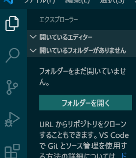

<link href="https://use.fontawesome.com/releases/v5.0.6/css/all.css" rel="stylesheet">
<style>
  a::after {
    padding: 0 4px;
    content: "\f35d";
    font-family: "Font Awesome 5 Free";
    font-weight: 900;
    font-size: 0.8rem;
  }
  @media print {
    @page { margin: 0; }
    body { margin: 1.6cm; }
  }
  h2 {
    border-left: solid 6px #28a745;
    border-bottom: none!important;
    padding-left: 16px;
    height: 40px!important;
    line-height: 40px!important;
    font-weight: bold!important;
  }
  h3 {
    padding-left: -14px;
    border-bottom: dashed #ccc 1px;
  }
  h3:before {
    content: "■ ";
    color: #17a2b8;
  }
  th, td {
    border: solid 1px #666;
  }
  table {
    margin-bottom: 30px;
  }
  strong {
    color: #f66;
  }
  hr {
    margin-bottom: 30px;
    border-color: #ccc;
  }
  blockquote {
    background: none!important;
    /* font-style: italic; */
    color: #999;
  }
</style>

# Laravel 資料 4 　 バリデーション

## 導入

本資料では Laravel での バリデーションとフラッシュメッセージについて、資料 2 と 3 で作成したログインページに機能を実装しながら説明を行う。

以下の手順で行っていく。

1. 用語説明
1. バリデーション実装
   1. validate メソッドによるバリデーション
   1. ビューの変更（共通）
   1. バリデータ生成によるバリデーション
   1. フォームリクエスト生成によるバリデーション
   1. エラーメッセージの日本語化
1. 入力値の保持

## バリデーションとは

バリデーション（Validation［発音記号：v`ælədéɪʃən］）とは批准、確認という意味で、プログラミングにおいては入力値のチェックを意味する。

ユーザが入力した内容が要件（入力形式）を満たしているか、必須入力の項目に抜けがないか、不正な値が入力されていないかといったことをチェックする機能である。

### Laravel におけるバリデーション

入力されたリクエストパラメータに対し、バリデーションで設定したルールに基づいてチェックを行う。  
すべてのチェックが成功するとバリデーション以降の処理が実行され、失敗した場合は例外が投げられ、自動的に前のページへリダイレクトする。  
また、バリデーションエラーはフラッシュデータとして保存される。

フラッシュデータとは、直後の HTTP リクエスト（ページ遷移と思えばよい）の間だけセッションに保存されるデータのことである。

エラーメッセージは`$errors`という変数名でビューに渡される。

<div class="page"></div>

## バリデーションの実装

本資料では 3 通りのバリデーション方法を説明する。

1. validate メソッド
1. バリデータの生成
1. フォームリクエストの生成

ビュー側は共通であるため validate メソッドの項目でのみ説明する。  
どの方法についても資料 3 の最終段階に対して、以下の変更を加えた後の差分を示す。

【app\Http\Controllers\LoginController.php】

```diff
  <?php

  namespace App\Http\Controllers;

  use Illuminate\Http\Request;
  use App\Models\User;

  class LoginController extends Controller
  {
    public function getIndex()
    {
      （略）
    }

    public function postIndex(Request $request)
    {
      // リクエストパラメータを配列として全件取得
      $input = $request->all();
-
-     // 権限はNOT NULLのため入力されてなければすぐ弾いていい
-     if (!isset($input['authority'])) {
-       return view('login/login');
-     }

      // DBのデータと照合
      $db_result = User::where('name', $input['name'])
      ->where('password', $input['password'])
      ->where('authority', $input['authority'])
      ->get();

      // 一致するデータなし
      if (count($db_result) == 0) {
        return view('login/login');
      }

      return view('login/result')->with('input', $input);
    }
  }
```

バリデーションで権限（authority）は必須入力とするため、権限の NULL 判定は不要になるため削除する。

<div class="page"></div>

## 1.validate メソッド

### 1-1.コントローラの変更

`Illuminate\Http\Request`オブジェクトの`validate`メソッドを使用する。

【app\Http\Controllers\LoginController.php】

```diff
  <?php

  namespace App\Http\Controllers;

  use Illuminate\Http\Request;
  use App\Models\User;

  class LoginController extends Controller
  {
    public function getIndex()
    {
      （略）
    }

    public function postIndex(Request $request)
    {
+     // Validation
+     $rules = [
+       'name' => 'required',
+       'password' => 'required',
+       'authority' => 'required|integer|min:1|max:2',
+     ];
+     $this->validate($request, $rules);
+
      // リクエストパラメータを配列として全件取得
      $input = $request->all();

      // DBのデータと照合
      $db_result = User::where('name', $input['name'])
      ->where('password', $input['password'])
      ->where('authority', $input['authority'])
      ->get();

      // 一致するデータなし
      if (count($db_result) == 0) {
        return view('login/login');
      }

      return view('login/result')->with('input', $input);
    }
  }
```

<div class="page"></div>

`validate` メソッドの第 1 引数にリクエストオブジェクト、第 2 引数に連想配列でバリデーションルールを渡している。

例えば`'requred'`は必須入力であることを示す。  
その他バリデーションルールについては公式ドキュメントを参照するとよい。

[（公式）使用可能なバリデーションルール](https://readouble.com/laravel/5.4/ja/validation.html#available-validation-rules)

### 1-2.ビューの変更（まとめて表示）

バリデーションに失敗した際にエラーメッセージを表示するよう、ログイントップページのビユーを変更する。

下記は上部にまとめてエラーメッセージを表示する方法である。  
`any` メソッドでエラーメッセージの存在確認を行い、その後 `all` メソッドで全フィールドの全エラーメッセージを取得して表示している。

【resources\views\login\login.blade.php】

```diff
  @extends('layout/layout')
  @section('content')
  <form method="post" action="/login">
    <h2>ログイン</h2>
+   @if ($errors->any())
+   <div class="alert alert-danger">
+     <ul>
+     @foreach ($errors->all() as $error)
+       <li>{{ $error }}</li>
+     @endforeach
+     </ul>
+   </div>
+   @endif
    {{ csrf_field() }}

 （略）
```

<div class="page"></div>

### 1-3.動作確認

何も入力せず「ログイン」ボタンを押下すると、再びログイントップページに遷移し、以下のようなエラーメッセージが表示される。


英語で必須入力のバリデーションエラーメッセージが表示されている。

<div class="page"></div>

### 1-4.ビューの変更（個別表示）

エラーメッセージを要素ごと個別に表示するようにビューを変更する。

`first`メソッドは指定したフィールドの最初のエラーメッセージを取得する（バリデーションルールが複数ある場合、複数のエラーメッセージが返されることはあり得る）。その結果を見てエラー用のクラスを付けたり、個別にメッセージを表示したりしている。

【resources\views\login\login.blade.php】

```diff
（略）
  <label>名前</label>
  <div class="form-group">
-   <input type="text" name="name" class="form-control">
+   <input type="text" name="name"
+     class="form-control @if(!empty($errors->first('name')))border-danger @endif">
+   <p>
+     <span class="help-block text-danger">{{$errors->first('name')}}</span>
+   </p>
  </div>
  <label>パスワード</label>
  <div class="form-group ">
-   <input type="password" name="password" class="form-control">
+   <input type="password" name="password"
+     class="form-control @if(!empty($errors->first('name')))border-danger @endif">
+   <p>
+     <span class="help-block text-danger">
+       {{$errors->first('password')}}
+     </span>
+   </p>
  </div>
  <label>権限</label>
- <div class="form-group">
+ <div class="form-group
+   @if(!empty($errors->first('authority')))text-danger @endif">
    <div class="radio-inline">
      <label>
        <input type="radio" name="authority" value="1">管理者
      </label>
    </div>
    <div class="radio-inline">
      <label>
        <input type="radio" name="authority" value="2">⼀般
      </label>
    </div>
+   <p>
+     <span class="help-block text-danger">{{$errors->first('authority')}}</span>
+   </p>
  </div>

（略）
```

<div class="page"></div>

### 1-5.動作確認

何も入力せず「ログイン」ボタンを押下すると、以下のようなエラーメッセージが表示される。


<div class="page"></div>

## 2.バリデータの生成

### 2-1.コントローラの変更

`Validator` ファサードを使い、バリデータインスタンスを`make`メソッドで生成する。

【app\Http\Controllers\LoginController.php】

```diff
  <?php

  namespace App\Http\Controllers;

  use Illuminate\Http\Request;
  use App\Models\User;
+ use Validator;

  class LoginController extends Controller
  {
    public function getIndex()
    {
      （略）
    }

    public function postIndex(Request $request)
    {
      // リクエストパラメータを配列として全件取得
      $input = $request->all();
+
+     // Validation
+     $rules = [
+       'name' => 'required',
+       'password' => 'required',
+       'authority' => 'required|integer|min:1|max:2',
+     ];
+     $this->validate($input, $rules);

      // DBのデータと照合
      $db_result = User::where('name', $input['name'])
      ->where('password', $input['password'])
      ->where('authority', $input['authority'])
      ->get();

      // 一致するデータなし
      if (count($db_result) == 0) {
        return view('login/login');
      }

      return view('login/result')->with('input', $input);
    }
  }
```

`make` メソッドの第 1 引数にリクエストパラメータ（連想配列）、第 2 引数に連想配列でバリデーションルールを渡している。

<div class="page"></div>

### 2-2.動作確認

1-5 の動作確認と同様の結果になることを確認する。  
何も入力せず「ログイン」ボタンを押下すると、以下のようなエラーメッセージが表示される。


<div class="page"></div>

### 2-3.エラーメッセージの日本語化（一部）

`make`メソッドは第 3 引数にカスタムエラーメッセージを渡すことができる。

`postIndex`メソッドに以下のように追記する。

【app\Http\Controllers\LoginController.php】

```diff
（略）
  public function postIndex(Request $request)
  {
    // リクエストパラメータを配列として全件取得
    $input = $request->all();

    // Validation
    $rules = [
      'name' => 'required',
      'password' => 'required',
      'authority' => 'required|integer|min:1|max:2',
    ];
+   $error_msg = [
+     'required' => ':attributeは必須入力です。'
+    ];
-   Validator::make($input, $rules)->validate();
+   Validator::make($input, $rules, $error_msg)->validate();

    // DBのデータと照合
    $db_result = User::where('name', $input['name'])
    ->where('password', $input['password'])
    ->where('authority', $input['authority'])
    ->get();

    // 一致するデータなし
    if (count($db_result) == 0) {
      return view('login/login');
    }

    return view('login/result')->with('input', $input);
  }
（略）
```

権限の必須入力以外のバリデーションルールは確認しづらいため、今回は required のエラーメッセージのみ記述した。

`:attribute`はプレースホルダであり、バリデーション対象のフィールドの名前（input タグの name）に置換される。

<div class="page"></div>

### 2-4.動作確認


何も入力せず「ログイン」ボタンを押下すると、以下のようなエラーメッセージが表示される。
input タグの name 要素で置換しているため、要素名は日本語化できていない。  
`:attribute`も日本語化する方法は次の項目で説明する。

<div class="page"></div>

## 3.フォームリクエストの生成

この方法の場合、複数ページに対するバリデーションの設定を一括で行える。  
そのため、基本的にはフォームリクエストの生成でバリデーションは行い、コントローラ内に記述する 2 つの方法は一部違うページなど、例外への対応として使用するのがよいだろう。

### 3-1.フォームリクエスト作成

shell を起動し（コマンドプロンプトや VSCode のターミナルでもよい）、`LaravelSample`ディレクトリ下で以下のコマンドを実行する。

```bash
php artisan make:request LoginRequest
```

「LoginRequest」が作成するフォームリクエストの名前である。  
命名規則としてはアッパーキャメルケースなだけで、必ずしも「Request」と名前に付ける必要はない。

生成されたリクエストクラスは`app/Http/Request`ディレクトリに設置される。

<div class="page"></div>

---

ところで VSCode にはワークスペースという概念がある。  
細かいことは分からなくてよいが、以下の「フォルダーを開く」から作業フォルダを開くか、この場所にフォルダをドラッグ＆ドロップすると、そのフォルダがワークスペースとして設定され、フォルダツリーが表示される。
 

これだけではさほど便利さは感じないが、ワークスペースに設定していると、`Ctrl+p`のショートカットキーで開く入力欄からファイル名を検索して開くことができる。  
手作業で探すよりもよほど早いため、活用することをおすすめする。


---

<div class="page"></div>

### 3-2.リクエストクラスの変更

作成したリクエストクラスを有効化し、ルールを追加する。

【app\Http\Requests\LoginRequest.php】

```diff
  <?php

  namespace App\Http\Requests;

  use Illuminate\Foundation\Http\FormRequest;

  class LoginRequest extends FormRequest
  {
      /**
      * Determine if the user is authorized to make this request.
      *
      * @return bool
      */
      public function authorize()
      {
-         return false;
+         return true;
      }

      /**
      * Get the validation rules that apply to the request.
      *
      * @return array
      */
      public function rules()
      {
          return [
-             //
+             'name' => 'required',
+             'password' => 'required',
+             'authority' => 'required|integer|min:1|max:2',
          ];
      }
  }
```

<div class="page"></div>

### 3-3.コントローラの変更

`postIndex`メソッドで受取るリクエストのタイプヒントを自作したリクエストクラスに変更する。  
これによってフォームから送られてきたリクエストは`LoginRequest.php`で設定したルールに基づいてバリデーションされた後、`postIndex`メソッドが実行されることになる。

【app\Http\Controllers\LoginController.php】

```diff
  <?php

  namespace App\Http\Controllers;

- use Illuminate\Http\Request;
  use App\Models\User;
+ use App\Http\Requests\LoginRequest;

  class LoginController extends Controller
  {
    public function getIndex()
    {
      (略)
    }

-   public function postIndex(Request $request)
+   public function postIndex(LoginRequest $request)
    {
      // リクエストパラメータを配列として全件取得
      $input = $request->all();

      // DBのデータと照合
      $db_result = User::where('name', $input['name'])
      ->where('password', $input['password'])
      ->where('authority', $input['authority'])
      ->get();

      // 一致するデータなし
      if (count($db_result) == 0) {
        return view('login/login');
      }

      return view('login/result')->with('input', $input);
    }
  }
```

実質 use の行が増えただけである。  
コントローラに処理を書きすぎると読みづらくなるめ、分けられるものはなるべく分けて書くとよい。

また、前述の通り登録と更新のような同様の入力項目のページに対し、リクエストクラスのタイプヒントを変更するのみで同じバリデーションを設定できる点もこの方法の利点である。

<div class="page"></div>

### 3-4.エラーメッセージの日本語化

3-3 の動作確認の説明は 1-5、2-2 と同じ結果のため省略する。

この項目では言語ファイルの設定を変更し、日本語化を行う。

#### 3-4-1.言語設定ファイルの作成

`resources\lang\`ディレクトリに移動すると、英語の言語設定フォルダ「en」が存在する。  
同じ階層に日本語用の「ja」フォルダを作成する。


今回は github から日本語用設定ファイルをダウンロードする。  
ターミナルで ja ディレクトリに移動し、以下のコマンドを実行する。

```bash
curl -OL https://raw.githubusercontent.com/rito-nishino/Laravel-Japanese-Language-fileset/master/auth.php
curl -OL https://raw.githubusercontent.com/rito-nishino/Laravel-Japanese-Language-fileset/master/pagination.php
curl -OL https://raw.githubusercontent.com/rito-nishino/Laravel-Japanese-Language-fileset/master/passwords.php
curl -OL https://raw.githubusercontent.com/rito-nishino/Laravel-Japanese-Language-fileset/master/validation.php
```


すべてダウンロードが終了したら、念の為ファイルを ja フォルダに確認しに行く。
ダウンロードした`auth.php`、`pagination.php`、`passwords.php`、`validation.php`が存在していれば問題ない。

<div class="page"></div>

なお、各ファイルは以下のような記述になっている。  
2-3 で日本語化した際と同様に連想配列で書かれていることがわかる。


#### 3-4-2.使用言語設定の変更

`config\app.php`の`locale`の設定を`ja`に変更する。

【config\app.php】

```diff
    /*
    |---------------------------------------------------------------------
    | Application Locale Configuration
    |---------------------------------------------------------------------
    |
    | The application locale determines the default locale that will be used
    | by the translation service provider. You are free to set this value
    | to any of the locales which will be supported by the application.
    |
    */

-   'locale' => 'en',
+   'locale' => 'ja',
```

ここで動作確認を行えば、2-4 の動作確認と同じ状態になっている。

<div class="page"></div>

#### 3-4-3.フィールド名の日本語化

言語ファイルを編集し、バリデーションメッセージの`:attribute`部分を日本語化する。  
以下のように入力項目のフィールド名にそれぞれ対応した日本語を設定する。

【resources\lang\ja\validation.php】

```diff
    /*
      |---------------------------------------------------------------------
      | Custom Validation Attributes
      | カスタム検証属性
      |---------------------------------------------------------------------
      |
      | The following language lines are used to swap attribute place-holders
      | with something more reader friendly such as E-Mail Address instead
      | of "email". This simply helps us make messages a little cleaner.
      |
      | 次の言語行は、属性プレースホルダを「email」ではなく「E-Mail Address」などの
      | 読みやすいものと交換するために使用されます。
      |
    */

-   'attributes' => [],
+   'attributes' => [
+       'name' => '名前',
+       'password' => 'パスワード',
+       'authority' => '権限'
+   ],
```

<div class="page"></div>

#### 3-4-4.動作確認

何も入力せず「ログイン」ボタンを押下し、バリデーションエラーメッセージがすべて日本語化されていることを確認する。


<div class="page"></div>

## 入力値の保持

バリデーションエラーで戻されるたびに入力をし直すことはユーザにとって非情に面倒である。  
今回のような入力項目が少ない場合であればまだしも、EC サイトのユーザ登録のような大量の入力項目が存在するページの場合、登録自体が億劫になり、そこで離脱してしまう可能性もある。  
そういうのはよくない。

Laravel において、直前のリクエストの入力データはフラッシュデータとして保持している。

値を取り出すには、`Request`インスタンスに対し`old`メソッドを使用する。

```php
$sample_code = $request->old('fieldName');
```

ビュー側で取り出したい場合は、`old`ヘルパを使用し、以下のように記述する。

```html
<input type="text" name="fieldName" value="{{ old('fieldName') }}" />
```

上記の処理をログイントップページに実装する。

<div class="page"></div>

今回はコントローラ側で直前の入力値を参照することはないため、ビューのみ変更する。

ただし、パスワードについては再入力させるフォームがほとんどのため、処理は追加しない。

【resources\views\login\login.blade.php】

```diff
（略）

    <label>名前</label>
    <input type="text" name="name"
-     class="form-control @if(!empty($errors->first('name')))border-danger @endif">
+     class="form-control @if(!empty($errors->first('name')))border-danger @endif"
+     value="{{ old('name') }}">

（略）

  <label>権限</label>
  <div class="form-group
    @if(!empty($errors->first('authority')))text-danger @endif">
    <div class="radio-inline">
      <label>
-       <input type="radio" name="authority" value="1">管理者
+       <input type="radio" name="authority" value="1"
+         @if (old('authority') == 1) checked @endif>管理者
      </label>
    </div>
    <div class="radio-inline">
      <label>
-       <input type="radio" name="authority" value="2">⼀般
+       <input type="radio" name="authority" value="2"
+         @if (old('authority') == 2) checked @endif>⼀般
      </label>
    </div>
    <span class="help-block">{{$errors->first('authority')}}</span>
  </div>

（略）
```

<div class="page"></div>

### 動作確認

以下の項目について動作確認を行う。

1. 名前、パスワードを入力し「ログイン」ボタンを押下。名前の入力保持、パスワードの入力は保持されず、権限未入力のバリデーションエラーが出ることを確認する（参考：画像 1）
1. 名前、権限を入力し「ログイン」ボタンを押下。名前の入力保持、権限の入力保持、パスワード未入力のバリデーションエラーが出ることを確認する（参考：画像 2）

画像 1  


画像 2  


<div class="page"></div>

## 最終段階のソース

フォームリクエストを生成する方法のソースコードのみ示す。

### resources\views\login\login.blade.php

長いため 2 ページに分割して示す。

```html
@extends('layout/layout') @section('content')
<form method="post" action="/login">
  <h2>ログイン</h2>
  @if ($errors->any())
  <div class="alert alert-danger">
    <ul>
      @foreach ($errors->all() as $error)
      <li>{{ $error }}</li>
      @endforeach
    </ul>
  </div>
  @endif {{ csrf_field() }}
```

<div class="page"></div>

```html
  <label>名前</label>
  <div class="form-group">
    <input type="text" name="name"
      class="form-control @if(!empty($errors->first('name')))border-danger @endif"
      value="{{ old('name') }}">
    <p>
      <span class="help-block text-danger">{{$errors->first('name')}}</span>
    </p>
  </div>
  <label>パスワード</label>
  <div class="form-group ">
    {{-- Laravelではパスワードのoldは自動的にNULLになるため書かない --}}
    <input type="password" name="password"
      class="form-control @if(!empty($errors->first('name')))border-danger @endif">
    <p>
      <span class="help-block text-danger">
        {{$errors->first('password')}}
      </span>
    </p>
  </div>
  <label>権限</label>
  <div class="form-group
    @if(!empty($errors->first('authority')))text-danger @endif">
    <div class="radio-inline">
      <label>
        <input type="radio" name="authority" value="1"
          @if (old('authority') == 1) checked @endif>管理者
      </label>
    </div>
    <div class="radio-inline">
      <label>
        <input type="radio" name="authority" value="2"
          @if (old('authority') == 2) checked @endif>⼀般
      </label>
    </div>
    <p>
      <span class="help-block text-danger">{{$errors->first('authority')}}</span>
    </p>
  </div>
  <br>
  <input type="submit" value="ログイン" class="btn btn-primary">
</form>
@stop
```

<div class="page"></div>

### app\Http\Controllers\LoginController.php

```php
  <?php

  namespace App\Http\Controllers;

  use Illuminate\Http\Request;
  use App\Models\User;
  use Validator;
  use App\Http\Requests\LoginRequest;

  class LoginController extends Controller
  {
    public function getIndex()
    {
      (略)
    }

    public function postIndex(LoginRequest $request)
    {
      // リクエストパラメータを配列として全件取得
      $input = $request->all();

      // DBのデータと照合
      $db_result = User::where('name', $input['name'])
      ->where('password', $input['password'])
      ->where('authority', $input['authority'])
      ->get();

      // 一致するデータなし
      if (count($db_result) == 0) {
        return view('login/login');
      }

      return view('login/result')->with('input', $input);
    }
  }
```

<div class="page"></div>

### app\Http\Requests\LoginRequest.php

```php
  <?php

  namespace App\Http\Requests;

  use Illuminate\Foundation\Http\FormRequest;

  class LoginRequest extends FormRequest
  {
      /**
      * Determine if the user is authorized to make this request.
      *
      * @return bool
      */
      public function authorize()
      {
          return true;
      }

      /**
      * Get the validation rules that apply to the request.
      *
      * @return array
      */
      public function rules()
      {
          return [
              'name' => 'required',
              'password' => 'required',
              'authority' => 'required|integer|min:1|max:2',
          ];
      }
  }
```

<div class="page"></div>

### config\app.php

```php
（略）
    /*
    |--------------------------------------------------------------------------
    | Application Locale Configuration
    |--------------------------------------------------------------------------
    |
    | The application locale determines the default locale that will be used
    | by the translation service provider. You are free to set this value
    | to any of the locales which will be supported by the application.
    |
    */

    'locale' => 'ja',

（略）
```

### resources\lang\ja\validation.php

```php
（略）
    /*
      |--------------------------------------------------------------------------
      | Custom Validation Attributes
      | カスタム検証属性
      |--------------------------------------------------------------------------
      |
      | The following language lines are used to swap attribute place-holders
      | with something more reader friendly such as E-Mail Address instead
      | of "email". This simply helps us make messages a little cleaner.
      |
      | 次の言語行は、属性プレースホルダを「email」ではなく「E-Mail Address」などの
      | 読みやすいものと交換するために使用されます。
      |
    */

    'attributes' => [
        'name' => '名前',
        'password' => 'パスワード',
        'authority' => '権限'
    ],
（略）
```
