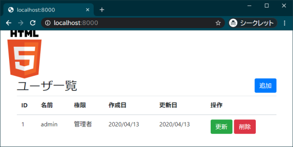
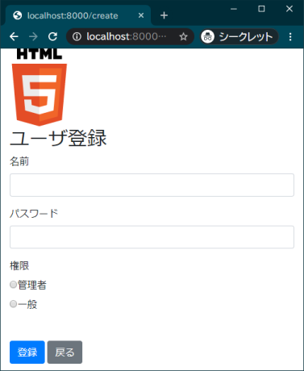
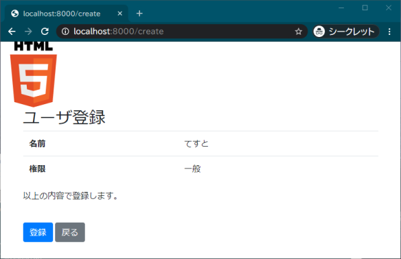
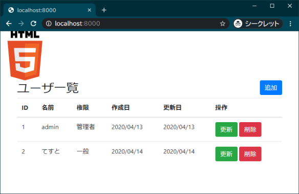
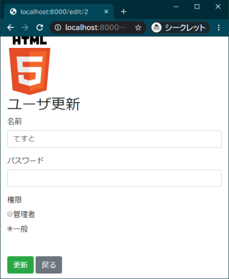
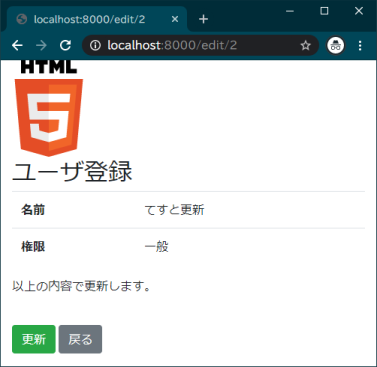
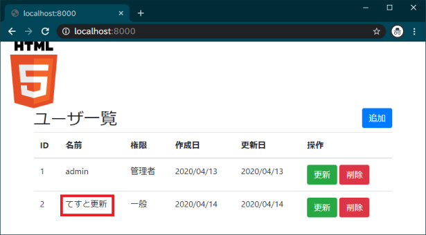
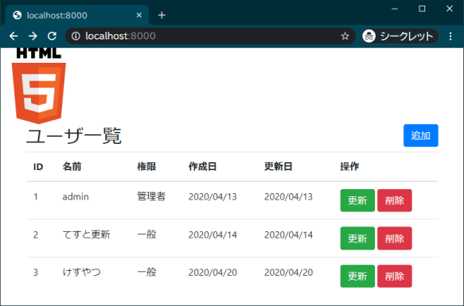
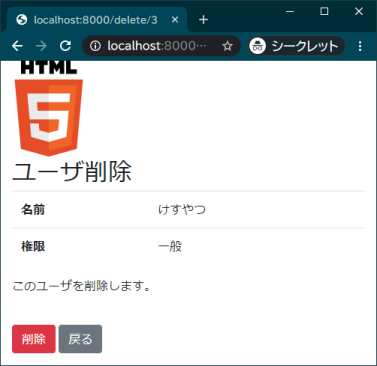
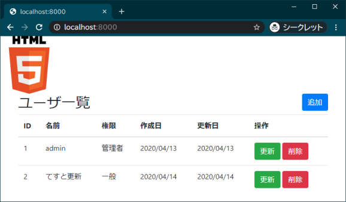

<link href="https://use.fontawesome.com/releases/v5.0.6/css/all.css" rel="stylesheet">

<style>
  a::after {
    padding: 0 4px;
    content: "\f35d";
    font-family: "Font Awesome 5 Free";
    font-weight: 900;
    font-size: 0.8rem;
  }
  @media print {
    @page { margin: 0; }
    body { margin: 1.6cm; }
  }
  h2 {
    border-left: solid 6px #28a745;
    border-bottom: none!important;
    padding-left: 16px;
    height: 40px!important;
    line-height: 40px!important;
    font-weight: bold!important;
  }
  h3 {
    padding-left: -14px;
    border-bottom: dashed #ccc 1px;
  }
  h3:before {
    content: "■ ";
    color: #17a2b8;
  }
  th, td {
    border: solid 1px #666;
  }
  table {
    margin-bottom: 30px;
  }
  strong {
    color: #f66;
  }
  hr {
    margin-bottom: 30px;
    border-color: #ccc;
  }
  blockquote {
    background: none!important;
    /* font-style: italic; */
    color: #999;
  }
</style>

# Laravel 資料 5 　 Eloquent

## 導入

本資料では Laravel での SQL の発行について Eloquent を使用してログインページにユーザ登録・更新・削除機能を実装しながら説明を行う。

資料 3 での Eloquent の説明再掲

> Eloquent（エロクエント［発音記号：éləkwənt］）とは Laravel の提供する ORM である。  
> ORM（Object-relational mapping：オブジェクト関係マッピング）は、DB のレコードをオブジェクトとして直感的に扱えるようにする仕組みで、これにより SQL を意識することなく DB との連携が書けるというのがメリットである。

Laravel の DB 操作の方法には Eloquent の他に、DB ファサードを使用する方法も存在する。  
DB ファサードを用いる場合の基本的な書き方は資料末尾に付録として示す。

本資料は以下の手順で実装を行っていく。

1. ルーティング追加
1. 実装
   1. ユーザ一覧
   1. ユーザ登録
   1. ユーザ更新
   1. ユーザ削除
1. Eloquent まとめ（登録・更新・削除）
1. （付録）DB ファサードによる CURD

<div class="page"></div>

## ルーティング追加

`web.php` に以下のルーティングを追加する。

【routes\web.php】

```php
Route::get('/', 'LoginController@list');
Route::get('/create', 'LoginController@create');
Route::post('/create', 'LoginController@createCheck');
Route::post('/create/done', 'LoginController@createDone');
Route::get('/edit/{id}', 'LoginController@edit');
Route::post('/edit/{id}', 'LoginController@editCheck');
Route::post('/edit/done/{id}', 'LoginController@editDone');
Route::get('/delete/{id}', 'LoginController@delete');
Route::post('/delete/done/{id}', 'LoginController@deleteDone');
```

### ルートパラメーター

更新と削除は操作したいユーザの ID を受け取る必要がある。  
今回は以下のようにルートパラメーターを使って ID を渡す。

```php
Route::get('/edit/{id}', 'LoginController@edit');
```

波括弧`{}`の中のアルファベットがルートパラメーターである。

コントローラ側でこの値（id）を受け取るには、以下のように書けばよい。

```php
public function edit($id) {
（略）
```

edit メソッドの第一引数に`$id`と書いているように、パラメーター名と同じ名前の引数にすることで紐付けられる。

<div class="page"></div>

## ユーザ一覧ページの作成

`users`テーブルのデータをすべて表示するページを作成する。

### コントローラー作成

ルーティングで設定した通り`list`メソッドを作成する。

【app\Http\Controllers\LoginController.php】

```php
public function list()
{
  try {
    $db_result = User::all();
    return view('login/list')->with('list', $db_result);
  } catch (Exception $e) {
    return view('error');
  }
}
```

#### 処理の概要

`User::all()`で`users`テーブルからすべてのレコードを連想配列で取得し、そのままビューに渡している。
DB 接続で**例外**（Exception）が発生した場合に備えて try-catch 構文の中に処理を記述し、例外が発生したらエラーページを表示するようにしている。  
ただ、これは何も書かないよりはましレベルのとても雑な例外処理である。

<div class="page"></div>

### ビュー作成

新規にユーザ一覧ページとエラーページを作成する。

【resources\views\login\list.blade.php】

<!-- フォーマットすると微妙になるので最後に直す -->

```html
@extends('layout/layout')
@section('content')
<div>
  <h2 class="d-inline-block">ユーザ一覧</h2>
  <a href="/create" class="btn btn-primary float-right">追加</a>
</div>
@if (isset($list))
<table class="table table-hover">
  <thead>
    <tr>
      <th>ID</th>
      <th>名前</th>
      <th>権限</th>
      <th>作成日</th>
      <th>更新日</th>
      <th>操作</th>
    </tr>
  </thead>
  <tbody>
    @foreach ($list as $item)
    <tr>
      <td>{{ $item->id }}</td>
      <td>{{ $item->name }}</td>
      <td>
      @if ($item->authority == '1')
        管理者
      @elseif($item->authority == '2')
        一般
      @endif
      </td>
      <td>{{ date('Y/m/d', strtotime($item->created_at)) }}</td>
      <td>{{ date('Y/m/d', strtotime($item->updated_at)) }}</td>
      <td>
        <a href="/edit/{{ $item->id }}" class="btn btn-success">更新</a>
        <a href="/delete/{{ $item->id }}" class="btn btn-danger">削除</a>
      </td>
    </tr>
    @endforeach
  </tbody>
</table>
@else
<p>ユーザは登録されていませんでした。</p>
@endif
@stop
```

ルーティングで各ページの URL はすでに決まっているため、現時点でリンクはすべて設定してある。  
そのため本資料でこれ以降 list.blade.php を変更することはない。

<div class="page"></div>

【resources\views\error.blade.php】

```html
@extends('layout/layout')
@section('content')
<p>サーバに障害が発生しています。</p>
<a href="/">一覧に戻る</a>
@stop
```

## 動作確認

一覧画面（[http://localhost:8000/](http://localhost:8000/)）にアクセスし、DB に登録してあるデータが表示されていることを確認する。



<div class="page"></div>

## ユーザ登録ページの作成

### コントローラー作成

`LoginController`に以下のように`create`メソッドを追加する。

【app\Http\Controllers\LoginController.php】

```php
public function create()
{
  return view('login/create/input');
}
```

### ビュー作成

登録ページのビューは`create`フォルダを作成し、その中に作ることにする。  
`input.blade.php`を`login/create`の中に作成する。

内容はログイントップページとほぼ同じである。

【resources\views\login\create\input.blade.php】

<!-- フォーマットすると微妙になるので最後に直す -->

```html
@extends('layout/layout')
@section('content')
<form method="post" action="/create">
  <h2>ユーザ登録</h2>
  @if ($errors->any())
  <div class="alert alert-danger">
    <ul>
    @foreach ($errors->all() as $error)
      <li>{{ $error }}</li>
    @endforeach
    </ul>
  </div>
  @endif
  {{ csrf_field() }}
  <label>名前</label>
  <div class="form-group">
    <input type="text" name="name"
      class="form-control
      @if(!empty($errors->first('name')))
        border-danger
      @endif"
      value="{{ old('name') }}">
    <p>
      <span class="help-block text-danger">
        {{$errors->first('name')}}
      </span>
    </p>
  </div>
```

<div class="page"></div>

```html
  <label>パスワード</label>
  <div class="form-group ">
    <input type="password" name="password"
      class="form-control
      @if(!empty($errors->first('name')))
        border-danger
      @endif">
    <p>
      <span class="help-block text-danger">
        {{$errors->first('password')}}
      </span>
    </p>
  </div>
  <label>権限</label>
  <div class="form-group
    @if(!empty($errors->first('authority')))
      text-danger
    @endif">
    <div class="radio-inline">
      <label>
        <input type="radio" name="authority" value="1"
          @if (old('authority') == 1) checked @endif>管理者
      </label>
    </div>
    <div class="radio-inline">
      <label>
        <input type="radio" name="authority" value="2"
          @if (old('authority') == 2) checked @endif>⼀般
      </label>
    </div>
    <p>
      <span class="help-block text-danger">
        {{$errors->first('authority')}}
      </span>
    </p>
  </div>
  <br>
  <input type="submit" value="登録" class="btn btn-primary">
  <a href="/" class="btn btn-secondary">戻る</a>
</form>
@stop
```

<div class="page"></div>

## ユーザ登録確認ページの作成

### コントローラー作成

`createCheck`メソッドを追加する。

【app\Http\Controllers\LoginController.php】

```php
public function createCheck(LoginRequest $request)
{
  return view('login/create/check')->with('input', $request->all());
}
```

### ビュー作成

【resources\views\login\create\check.blade.php】

<!-- フォーマットすると微妙になるので最後に直す -->

```html
@extends('layout/layout')
@section('content')
<form method="post" action="/create/done" id="create_form">
  <h2>ユーザ登録</h2>
  {{ csrf_field() }}
  <table class="table">
    <tr>
      <th scope="row">名前</th>
      <td>
        {{ $input['name'] }}
        <input type="hidden" name="name" value="{{ $input['name'] }}">
      </td>
    </tr>
    <tr>
      <th scope="row">権限</th>
      <td>
        @if ($input['authority'] === '1')
          管理者
        @else
          一般
        @endif
        <input type="hidden" name="authority" value="{{ $input['authority'] }}">
      </td>
    </tr>
  </table>
  <input type="hidden" name="password" value="{{ $input['password'] }}">
  <p>以上の内容で登録します。</p>
  <br>
</form>
<input type="submit" form="create_form" value="登録" class="btn btn-primary">
<button class="btn btn-secondary" onclick="history.back()">戻る</button>
@stop
```

<div class="page"></div>

## ユーザ登録実行処理の作成

実際に Eloquent で新規レコードを追加している部分である。

「登録しました」と表示するようなページを作成してもよいと思うが、今回は省略して登録成功後は一覧画面にリダイレクトするようにする。  
更新・削除も同様の方針で作成する。

### コントローラー作成

`createDone`メソッドを追加する。

【app\Http\Controllers\LoginController.php】

```php
public function createDone(LoginRequest $request)
{
  try {
    $user_record = new User;
    $user_record->name = $request->name;
    $user_record->password = $request->password;
    $user_record->authority = $request->authority;
    $user_record->save();

    return redirect()->action('LoginController@list');
  } catch (Exception $e) {
    return view('error');
  }
}
```

リダイレクトはルーティングを設定した URL を指定して以下のように書いても一覧画面にリダイレクトできる。  
サンプルコードはコントローラーとそのメソッドを指定する方法で記述したが、わかりやすい方で書いて構わない。

```php
  // 一覧ページのルーティング：Route::get('/', 'LoginController@list');
  return redirect('/');
```

<div class="page"></div>

## 動作確認

一覧画面（[http://localhost:8000/](http://localhost:8000/)）にアクセスし、「追加」ボタンを押下して適当なユーザを登録し、追加したユーザが一覧に表示されることを確認する。

また、phpMyAdmin でも確認して自動的に`created_at`と`updated_at`にも日時が入力されていれば問題ない。







<div class="page"></div>

## ユーザ更新ページの作成

### コントローラー作成

`edit`メソッドを追加する。

【app\Http\Controllers\LoginController.php】

```php
public function edit($id)
{
  try {
    $user_data = User::find($id);
    if (is_null($user_data)) {
      return redirect()->action('LoginController@list');
    }

    return view('login/edit/input')->with(
      'input', [
        'name' => $user_data->name,
        'authority' => $user_data->authority,
        'id' => $id
      ]);
  } catch (Exception $e) {
    return view('error');
  }
}
```

前述の通りルートパラメーターとして`$id`に ID が渡されている。  
users テーブルを ID で検索して、データがなければ一覧ページにリダイレクト、データがあれば取得したデータと ID をビューに渡している。

<div class="page"></div>

### ビューの作成

更新ページは登録ページとほぼ同じ画面である。

複製して作成するのは改修の手間が増えて本来は推奨しないが、簡単にするため今回はそのようにする。

登録ページのビューのフォルダを複製して、フォルダ名を`edit`に変更して各ファイルを変更していく。

【resources\views\login\edit\input.blade.php】

<!-- フォーマットすると微妙になるので最後に直す -->

```html
@extends('layout/layout')
@section('content')
<form method="post" action="/edit/{{ $input['id'] }}">
  <h2>ユーザ更新</h2>
  @if ($errors->any())
  <div class="alert alert-danger">
    <ul>
    @foreach ($errors->all() as $error)
      <li>{{ $error }}</li>
    @endforeach
    </ul>
  </div>
  @endif {{ csrf_field() }}
  <label>名前</label>
  <div class="form-group">
    <input type="text" name="name"
      class="form-control
      @if(!empty($errors->first('name')))
        border-danger
      @endif"
      @if(isset($input['name']))
        value="{{ $input['name'] }}"
      @else
        value="{{ old('name') }}"
      @endif>
    <p>
      <span class="help-block text-danger">
        {{$errors->first('name')}}
      </span>
    </p>
  </div>
```

<div class="page"></div>

```html
  <label>パスワード</label>
  <div class="form-group ">
    {{-- Laravelではパスワードのoldは自動的にNULLになるため書かない --}}
    <input type="password" name="password"
      class="form-control
      @if(!empty($errors->first('name')))
        border-danger
      @endif">
    <p>
      <span class="help-block text-danger">
        {{$errors->first('password')}}
      </span>
    </p>
  </div>
  <label>権限</label>
  <div class="form-group
  @if(!empty($errors->first('authority')))
    text-danger
  @endif">
    <div class="radio-inline">
      <label>
        <input type="radio" name="authority" value="1"
        @if(isset($input['authority']) && $input['authority'] == 1 ||
          old('authority') == 1) checked
        @endif>管理者
      </label>
    </div>
    <div class="radio-inline">
      <label>
        <input type="radio" name="authority" value="2"
        @if(isset($input['authority']) && $input['authority'] == 2 ||
          old('authority') == 2) checked
        @endif>一般
      </label>
    </div>
    <p>
      <span class="help-block text-danger">
        {{$errors->first('authority')}}
      </span>
    </p>
  </div>
  <br >
  <input type="submit" value="更新" class="btn btn-success">
  <a href="/" class="btn btn-secondary">戻る</a>
</form>
@stop
```

登録ページとの違いは、各入力要素に DB の値が最初から入っている点とタイトルとボタン名である。

<div class="page"></div>

## ユーザ更新確認ページの作成

### コントローラー作成

`editCheck`メソッドを追加する。

【app\Http\Controllers\LoginController.php】

```php
public function editCheck(LoginRequest $request, $id)
{
  $input = $request->all() + ['id' => $id];
  return view('login/edit/check')->with('input', $input);
}
```

### ビューの作成

【resources\views\login\edit\check.blade.php】

<!-- フォーマットすると微妙になるので最後に直す -->

```html
@extends('layout/layout')
@section('content')
<form method="post" action="/edit/done/{{ $input['id'] }}" id="edit_form">
  <h2>ユーザ更新</h2>
  {{ csrf_field() }}
  <table class="table">
    <tr>
      <th scope="row">名前</th>
      <td>
        {{ $input['name'] }}
        <input type="hidden" name="name" value="{{ $input['name'] }}">
      </td>
    </tr>
    <tr>
      <th scope="row">権限</th>
      <td>
        @if ($input['authority'] === '1')
        管理者
        @else
        一般
        @endif
        <input type="hidden" name="authority" value="{{ $input['authority'] }}">
      </td>
    </tr>
  </table>
  <input type="hidden" name="password" value="{{ $input['password'] }}">
  <p>以上の内容で更新します。</p>
  <br>
</form>
<input type="submit" form="edit_form" value="更新" class="btn btn-success">
<button class="btn btn-secondary" onclick="history.back()">戻る</button>
@stop
```

<div class="page"></div>

## ユーザ更新実行処理の作成

### コントローラー作成

`editDone`メソッドを追加する。

【app\Http\Controllers\LoginController.php】

```php
public function editDone(LoginRequest $request, $id)
{
  try {
    $user_record = User::find($id);
    $user_record->name = $request->name;
    $user_record->password = $request->password;
    $user_record->authority = $request->authority;
    $user_record->save();

    return redirect()->action('LoginController@list');
  } catch (Exception $e) {
    return view('error');
  }
}
```

登録処理との違いは以下の通り。（- が登録、+ が更新、同じ部分は印なし）  
ほぼ同じ書き方で書けるようになっている。

```diff
- $user_record = new User;
+ $user_record = User::find($id);
  $user_record->name = $request->name;
  $user_record->password = $request->password;
  $user_record->authority = $request->authority;
  $user_record->save();
```

<div class="page"></div>

## 動作確認

一覧画面（[http://localhost:8000/](http://localhost:8000/)）にアクセスする。  
そして新たにユーザを登録した後、そのユーザの「更新」ボタンを押下して情報を更新し、変更したとおりに一覧に表示されることを確認する。

また、phpMyAdmin でも確認して自動的に`updated_at`に更新した日時が入力されていれば問題ない。







<div class="page"></div>

## ユーザ削除ページの作成

### コントローラー作成

`delete`メソッドを追加する。

【app\Http\Controllers\LoginController.php】

```php
public function delete($id)
{
  try {
    $disp_data = User::find($id);
    return view('login/delete/check')->with('data', $disp_data);
  } catch (Exception $e) {
    return view('error');
  }
}
```

<div class="page"></div>

### ビューの作成

削除の場合入力する必要ははないため、削除ボタン押下後は削除確認ページに遷移する。

<!-- フォーマットすると微妙になるので最後に直す -->

【resources\views\login\delete\check.blade.php】

```html
@extends('layout/layout')
@section('content')
<form method="post" action="/delete/done/{{ $data->id }}" id="delete_form">
  <h2>ユーザ削除</h2>
  {{ csrf_field() }}
  <table class="table">
    <tr>
      <th scope="row">名前</th>
      <td>
        {{ $data->name }}
      </td>
    </tr>
    <tr>
      <th scope="row">権限</th>
      <td>
      @if ($data->authority === '1')
        管理者
      @else
        一般
      @endif
      </td>
    </tr>
  </table>
  <p>このユーザを削除します。</p>
  <br >
</form>
<input type="submit" form="delete_form" value="削除" class="btn btn-danger">
<button class="btn btn-secondary" onclick="history.back()">戻る</button>
@stop
```

<div class="page"></div>

## ユーザ削除処理の作成

### コントローラー作成

`deleteDone` メソッドを追加する。

【app\Http\Controllers\LoginController.php】

```php
public function deleteDone($id)
{
  try {
    $delete_user = User::find($id);
    $delete_user->delete();
    return redirect()->action('LoginController@list');
  } catch(Exception $e) {
    return view('error');
  }
}
```

## 動作確認

一覧画面（[http://localhost:8000/](http://localhost:8000/)）にアクセスする。  
そして新たにユーザを登録した後、そのユーザの「削除」ボタンを押下してユーザ削除処理を行い、削除したユーザが一覧から消えることを確認する。

phpMyAdmin で確認しても当該ユーザのデータが削除されていれば問題ない。







<div class="page"></div>

## Eloquent まとめ

### 追加

モデル（テーブル）の新しいインスタンスを作成し、各プロパティを設定後`save`メソッドを呼び出す。

```php
// 新しいUserクラスのインスタンスを作成
$user_record = new User;

// usersテーブルの各カラムに対応しているプロパティにデータを代入
$user_record->name      = 〈nameのデータ〉;
$user_record->password  = 〈passwordのデータ〉;
$user_record->authority = 〈authorityのデータ〉;

// saveメソッドを呼び出す
$user_record->save();
```

### 更新

モデル（テーブル）から更新したいレコードを取得した後、各プロパティを設定後`save`メソッドを呼び出す。

```php
// 更新したいレコードをIDで指定して取得
$user_record = User::find($id);

// usersテーブルの各カラムに対応しているプロパティにデータを代入
$user_record->name      = 〈nameのデータ〉;
$user_record->password  = 〈passwordのデータ〉;
$user_record->authority = 〈authorityのデータ〉;

// saveメソッドを呼び出す
$user_record->save();
```

### 削除

モデル（テーブル）から更新したいレコードを取得した後、`delete`メソッドを呼び出す。

```php
// 更新したいレコードをIDで指定して取得
$delete_user = User::find($id);

// deleteメソッドを呼び出す
$delete_user->delete();
```

<div class="page"></div>

## （付録）DB ファサードによる CURD

DB ファサードの使い方について、いくつか例を示す。  
詳しくは[公式ドキュメント](https://readouble.com/laravel/5.4/ja/queries.html)参照のこと。

use するもの

```php
use Illuminate\Support\Facades\DB;
```

### 検索（select）

#### users テーブルのデータをすべて取得

```php
$user_record = DB::table('users')->get();
```

DB ファサードで取得した値の型は**StdClass**となる。  
つまりはオブジェクトのため、各カラムの値は以下のようにアロー演算子を使って指定する。

```php
$user_name = $user_record->name
```

#### id が変数\$id のレコードを取得

```php
$user_record = DB::table('users')->where('id', $id)->get();
```

### 追加（insert）

DB ファサードを使った追加・更新では`created_at`と`updated_at`は自動的に入力されない。

```php
DB::table('users')->insert([
  'name'       => $request->name,
  'password'   => $request->password,
  'authority'  => $request->authority
]);
```

### 更新（update）

```php
DB::table('users')->where('id', $id)->update([
  'name'       => $request->name,
  'password'   => $request->password,
  'authority'  => $request->authority
]);
```

### 削除（delete）

```php
DB::table('users')->where('id', $id)->delete();
```
