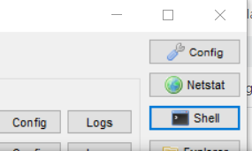
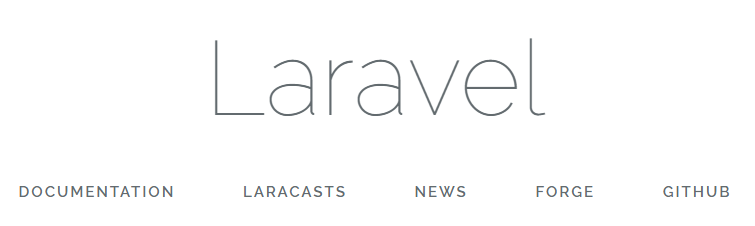

<link href="https://use.fontawesome.com/releases/v5.0.6/css/all.css" rel="stylesheet">
<style>
  a::after {
    padding: 0 4px;
    content: "\f35d";
    font-family: "Font Awesome 5 Free";
    font-weight: 900;
    font-size: 0.8rem;
  }
  @media print {
    @page { margin: 0; }
    body { margin: 1.6cm; }
  }
  h2 {
    border-left: solid 6px #28a745;
    border-bottom: none!important;
    padding-left: 16px;
    height: 40px!important;
    line-height: 40px!important;
    font-weight: bold!important;
  }
  h3 {
    padding-left: -14px;
    border-bottom: dashed #ccc 1px;
  }
  h3:before {
    content: "■ ";
    color: #17a2b8;
  }
  th, td {
    border: solid 1px #666;
  }
  table {
    margin-bottom: 30px;
  }
  strong {
    color: #f66;
  }
  hr {
    margin-bottom: 30px;
    border-color: #ccc;
  }
  blockquote {
    background: none!important;
    /* font-style: italic; */
    color: #999;
  }
</style>

# Laravel 資料

## 1.Laravel とは

## 2.環境構築

#### 前提

- Windows10 環境
- XAMPP をインストール済みで PHP、MySQL の設定も終了している

### 2-1.Composer のインストール

composer 経由で Laravel をインストールする。
[composer 公式](https://getcomposer.org/)から**Composer-Setup.exe**をダウンロードしてインストール作業を進める。リンク位置は下記画像参照。


↓


インストーラは 下記画像部分の php.exe へのパスが正しいか確認する以外はすべて「Next」でよい。
なお、XAMPP インストール時にパスを変更していなければデフォルトのままで問題ない。


インストール終了後、無事にインストールできたか確認する。
コマンドプロンプトを起動し、任意のディレクトリで以下のコマンドを入力する。

```
composer -V
```

問題がなければ`Composer version 1.9.3 2020-02-04 12:58:49`のようにインストールした composer のバージョン情報が表示される。

### 2-2.Laravel のインストールとプロジェクト作成

旧 Laravel 課題と統一するため、バージョン 5.5 を指定して Laravel のインストールを行う。

XAMPP の shell を起動し、htdocs に移動する。


```
cd \xampp\htdocs
```

ここでは例として「LaravelSample」プロジェクトを作成する。

```
composer create-project "laravel/laravel=5.5.*" LaravelSample
```

インストールが行われるのでしばらく待つ。
終了すると最後に`set successfully.`と表示される。

### 2-3.サーバの起動
Shellで2-2.で作成した「LaravelSample」に移動する。
```
cd LaravelSample
```
バージョンが5.5であることを確認しておく。
```
php artisan --version
```

サーバを起動する。
```
php artisan serve
```

以下のように表示されればwebサーバが起動した状態になっている。
Shellを閉じるとwebサーバも終了するため、サーバ起動中のShellは以降そのままにしておく。
```
Laravel development server started: <http://127.0.0.1:8000>
```
[http://localhost:8000/](http://localhost:8000/)にブラウザでアクセスし、下記画面が表示されることを確認する。


以上で環境構築は完了となる。