<link href="https://use.fontawesome.com/releases/v5.0.6/css/all.css" rel="stylesheet">

# SQL 資料 1 - phpMyAdmin の操作

## 新規 データベース 作成

### サーバの起動

XAMMP Control Panel の**Apache**と**MySQL**それぞれの start ボタンを押して Apache と MySQL を起動する。  
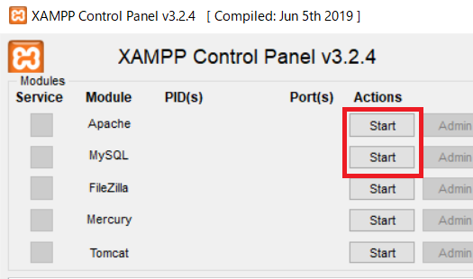  
 
MySQL の Admin ボタンを押すとブラウザで phpMyAdmin が開く。  
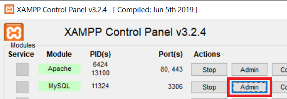
phpMyAdmin のページの「データベース」をクリックするとデータベース管理画面に遷移する。

### データベース 追加

任意の データベース（略称：DB） 名を付け、文字コード「utf8_general_ci」を選択して作成ボタン押下で新規 DB が作成される。  
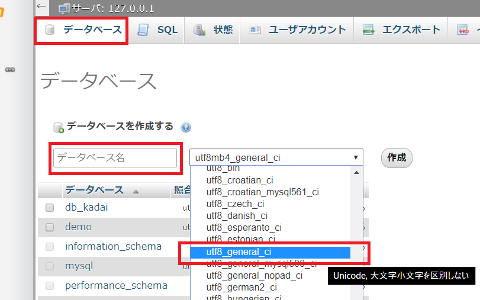

### テーブルの追加

任意のテーブル名と任意のカラム数を指定して、実行ボタン押下でテーブルが追加される。  
カラム数の後からでも設定できるため、現時点ではそこまで気にしなくてよい。  
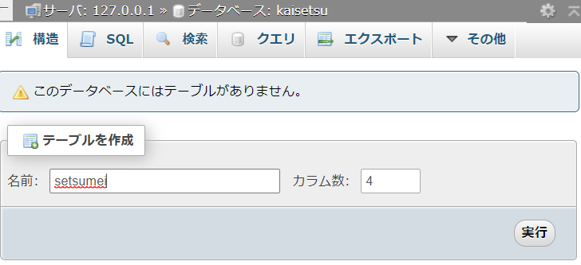

### カラムの追加

適宜必要な設定を行い、保存するボタン押下でカラムが追加される。  
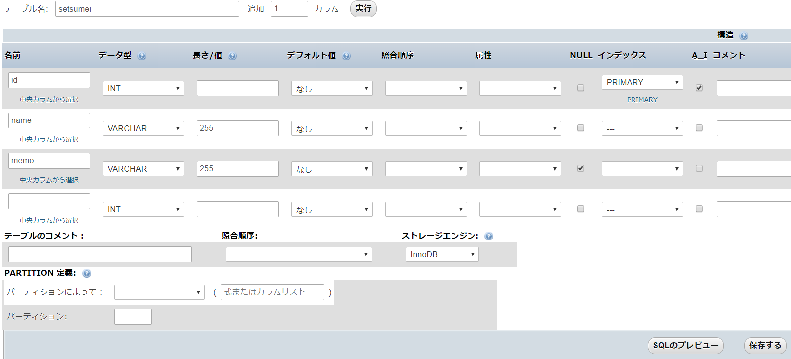

### レコードの追加

テーブルのページの上部メニュー「挿入」をクリックすると、新規レコード追加画面に遷移する  
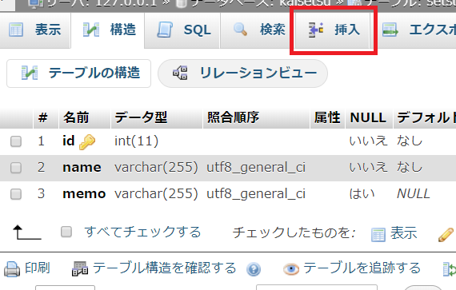

テキストボックスに必要な情報を入力し「実行」ボタンを押下すると登録される。  
複数のレコードを追加した場合はページ下部の「実行」ボタンを押下する。  
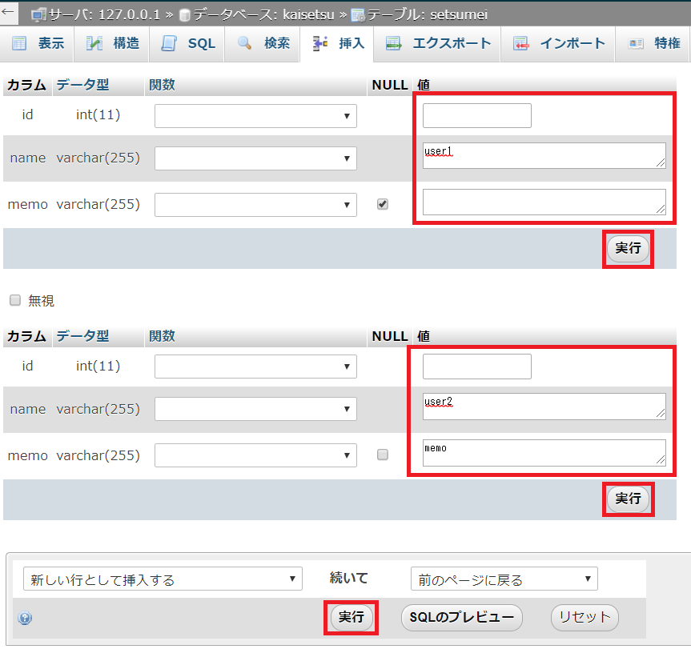

### レコードの確認と変更

テーブルのページの上部メニュー「表示」をクリックすると、選択しているテーブルのデータが全件表示される。  
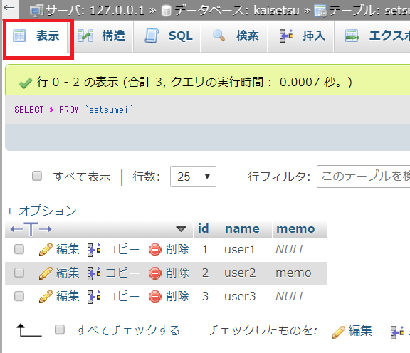

データの内容を変更したい場合、3 通りの方法がある。

1. レコードごとの「編集」をクリックする
1. 編集したい値をダブルクリックする
1. チェックボックスにチェックを入れ、下部メニューの「編集」をクリックする

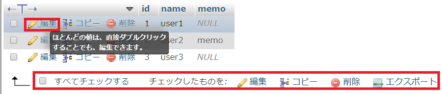

### 補足

#### よく使うデータ型

| データ型名 | 型の種類     |
| ---------- | ------------ |
| INT        | 整数型       |
| FLOAT      | 浮動小数点型 |
| VARCHAR    | 可変長文字型 |

#### NULL

「ヌル」あるいは「ナル」と読み、データが入力されていないことを表す。  
そのカラムが NULL を許可するかの設定は、phpMyAdmin では必須入力（NOT NULL）がデフォルトになっており、NULL のチェックボックスで設定する。

#### オートインクリメント

オートインクリメントを設定するとデータを新規追加した際に自動的に「現在格納されている最大の値+1」の数値が入る。  
主に被りのない連番を付けたい場合に利用する。

#### プライマリキー

プライマリキー（主キー）とは登録したデータのうち、特定の一つのデータを示すもの。  
ID のようなオートインクリメントを設定したカラムをプライマリキーに設定することが多い。  
phpMyAdmin ではオートインクリメントのチェックボックス「A_I」にチェックを入れると
自動的にプライマリキーの設定ウィンドウ（下記画像）が出てくるようになっている。  
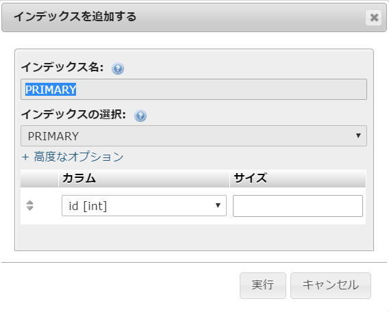

## DB の設定変更方法

Apache と MySQL のサーバが起動していることを前提とする。

### テーブルやカラムの追加

左側のツリー状メニューからそれぞれの項目の「新規作成」をクリックすると作成画面に遷移する。  
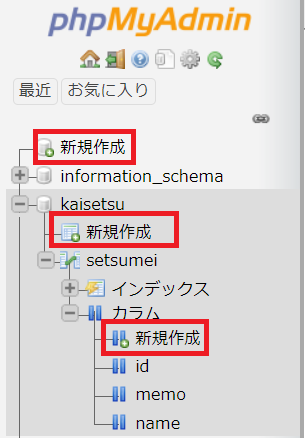

### カラムの設定変更

2 通りの方法を説明する。

1. 左側のツリー状メニューから項目名をクリックした後「構造」をクリックする。
   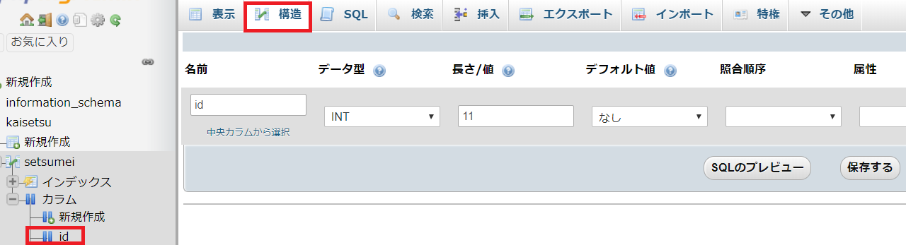
1. テーブルの「構造」ページにある表から操作したい項目をクリックする。
   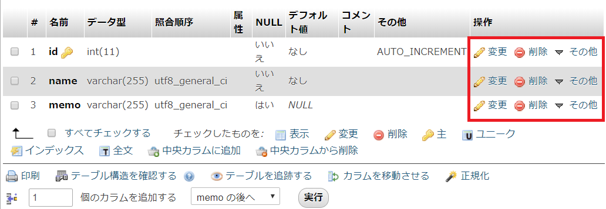

## phpMyAdmin で SQL を実行する

上部メニューの「SQL」をクリックすると SQL 入力画面に遷移する。  
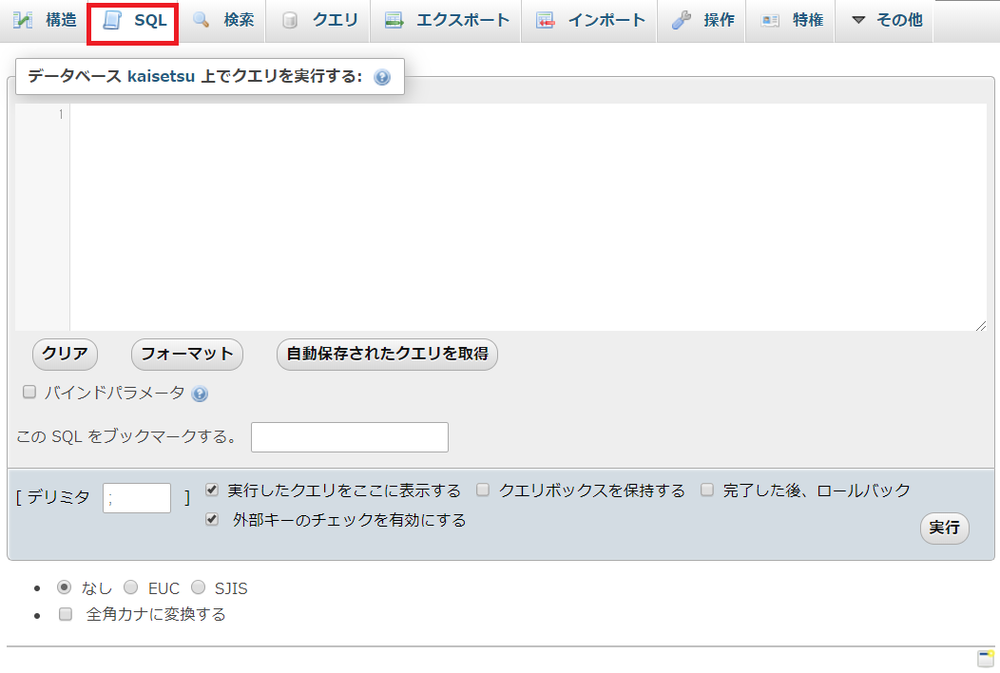

## DB のエクスポートとインポート

エクスポートで DB のバックアップファイルを出力し、そのファイルをインポートすることで元と同じ DB を作成できる。

### エクスポート

ひとつの DB そのものをエクスポートする場合、左側のツリー状メニューなどから DB を選択し、「エクスポート」をクリックするとエクスポート画面に遷移する。  
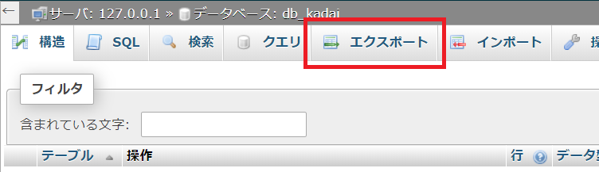

オプションの設定はそのままでよい。  
「実行」ボタンを押下すると sql ファイルがダウンロードされる。  
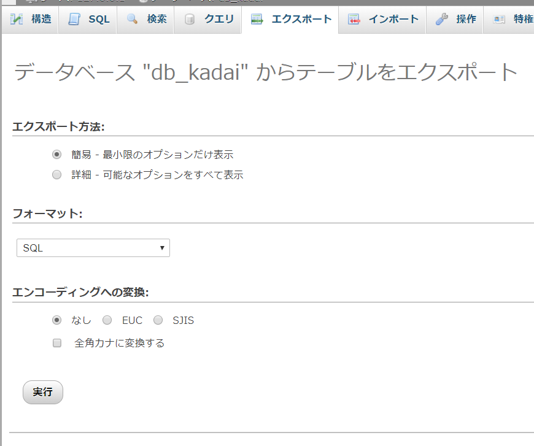

何度もエクスポートとインポートを繰り返す予定がある場合、テーブル名の重複によるエラーが予想される。  
それを回避するにはエクスポート時のオプションを変更するとよい。以下に手順を示す。

1. 「エクスポート方法」ラジオボタンを選択して簡易から詳細に変更する。
1. 「生成オプション」の「DROP TABLE...」にチェックを入れる

このオプションを設定することで、生成したいテーブルと同名のテーブルが既に存在するならば、一度既存のテーブルを消去してから改めてテーブルを生成するようになる。

### インポート

上部メニューの「インポート」をクリックするとインポート画面に遷移する。  
「ファイルを選択」ボタンを押下するとエクスプローラーが開く。そこでエクスポートしたファイルを選択し、「実行」ボタンを押下することでインポートが行われる。  
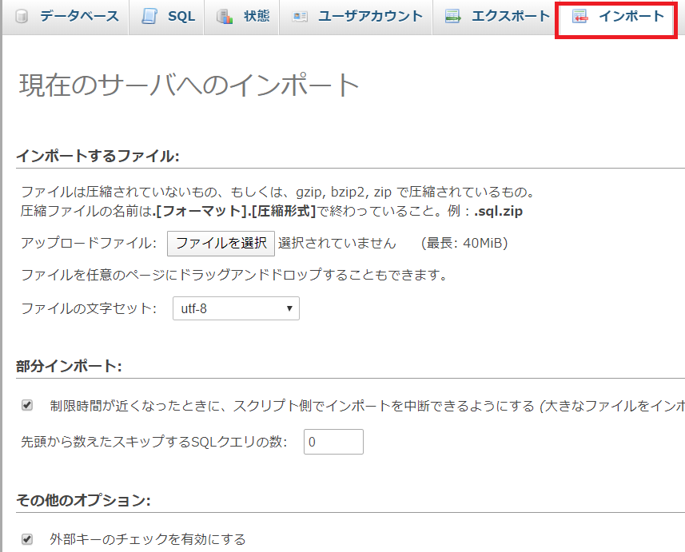
