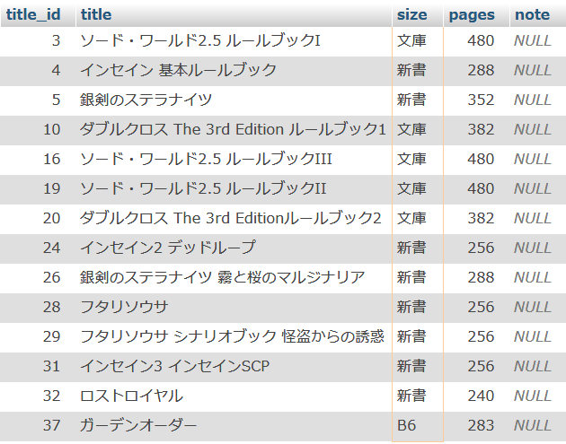
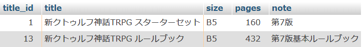

<link href="https://use.fontawesome.com/releases/v5.0.6/css/all.css" rel="stylesheet">
<style>
  a::after {
    padding: 0 4px;
    content: "\f35d";
    font-family: "Font Awesome 5 Free";
    font-weight: 900;
    font-size: 0.8rem;
  }
  @media print {
    @page { margin: 0; }
    body { margin: 1.6cm; }
  }
  h2 {
    border-left: solid 6px #28a745;
    border-bottom: none!important;
    padding-left: 16px;
    height: 40px!important;
    line-height: 40px!important;
    font-weight: bold!important;
  }
  h3 {
    padding-left: -14px;
    border-bottom: dashed #ccc 1px;
  }
  h3:before {
    content: "■ ";
    color: #17a2b8;
  }
  th, td {
    border: solid 1px #666;
  }
  table {
    margin-bottom: 30px;
  }
  strong {
    color: #f66;
  }
  hr {
    margin-bottom: 30px;
    border-color: #ccc;
  }
  blockquote {
    background: none!important;
    /* font-style: italic; */
    color: #999;
  }
</style>

# SQL チュートリアル - 基礎

## 導入

SQL とは Structured Query Language の略で、データベースの操作を行うための言語である。  
また、データベース操作言語によって記述された命令文のことをクエリという。
SQL はデータベースごとに独自の拡張を加えたものが使われているが、基本的な SQL は共通している。本研修では MySQL を使用するが、他のデータベースでも利用できるような基本的な SQL について解説していく。

### SELECT 文

DB に対して検索を行い、データを抽出する SQL が SELECT 文である。  
CRUD（クラッド）の R（Read）に当たる操作であり、最も使用頻度が高い。  
本資料内では基本的な SELECT 文についてチュートリアルを行い、発展的な SELECT 文とその他のデータ操作については別の資料で触れる。  
<br>
なお、CRUD とはアプリケーションの持つ基本機能の頭文字を並べたもので、SQL との対応は以下の表のようになっている。

| 基本機能 | SQL    | 操作         |
| -------- | ------ | ------------ |
| Create   | INSERT | 追加（生成） |
| Read     | SELECT | 検索（読取） |
| Update   | UPDATE | 更新         |
| Delete   | DELETE | 削除         |

<div class="page">

## チュートリアル用のテーブル作成

以下のテーブルを作成する。以降のチュートリアルでは特に記述がない限りこのテーブルに対して SQL を発行していく。  
DB については任意の DB 名で別紙の phpMyAdmin の資料で説明した通りに作成していれば問題ない。

### books テーブル

title_id にプライマリーキーとオートインクリメントを設定する。

| カラム名 | 意味        | 型          | NULL |
| -------- | ----------- | ----------- | ---- |
| title_id | タイトル ID | INT         | ×    |
| title    | タイトル    | VARCHAR(32) | ×    |
| size     | 判型        | VARCHAR(4)  | ×    |
| pages    | ページ数    | INT         | ×    |
| note     | 備考        | VARCHAR(64) | ○    |

<div class="page">

#### データ入力

データ入力の手間を省くため、チュートリアル用データ追加の SQL 文を以下に示す。  
books テーブルの SQL 入力画面に移動して実行すること（画像参照）。  


```sql
INSERT INTO `books` (`title_id`, `title`, `size`, `pages`, `note`) VALUES
(1, '新クトゥルフ神話TRPG スターターセット', 'B5', 160, '第7版'),
(2, 'シノビガミ 基本ルールブック', 'B5', 256, NULL),
(3, 'ソード・ワールド2.5 ルールブックI', '文庫', 480, NULL),
(4, 'インセイン 基本ルールブック', '新書', 288, NULL),
(5, '銀剣のステラナイツ', '新書', 352, NULL),
(6, 'パグマイア 基本ルールブック', 'B5', 240, NULL),
(7, '永い後日談のネクロニカ', 'B5', 208, NULL),
(8, 'カオスフレア Second Chapter', 'B5', 278, NULL),
(9, 'パラノイア【トラブルシューターズ】', 'A4', 208, '基本ルールブック'),
(10, 'ダブルクロス The 3rd Edition ルールブック1', '文庫', 382, NULL),
(11, 'モノトーンミュージアム', 'A5', 271, NULL),
(12, 'ゆうやけこやけ', 'B5', 164, NULL),
(13, '新クトゥルフ神話TRPG ルールブック', 'B5', 432, '第7版基本ルールブック'),
(14, 'ビーストバインドトリニティ', 'B5', 287, '第3版基本ルールブック'),
(15, 'クトゥルフ神話TRPG', 'B5', 367, '第6版基本ルールブック'),
(16, 'ソード・ワールド2.5 ルールブックIII', '文庫', 480, NULL),
(17, 'インセイン シナリオ集 ブラックデイズ', 'B5', 160, NULL),
(18, 'シノビガミ シナリオ集 忍秘伝・改', 'B5', 156, NULL),
(19, 'ソード・ワールド2.5 ルールブックII', '文庫', 480, NULL),
(20, 'ダブルクロス The 3rd Editionルールブック2', '文庫', 382, NULL),
(21, '魔道書大戦RPG マギカロギア 基本ルールブック', 'B5', 256, NULL),
(22, 'クトゥルフ神話TRPG クトゥルフ2010', 'B5', 159, '第6版'),
(23, 'ダブルクロスThe 3rd Edition上級ルールブック', 'B5', 207, NULL),
(24, 'インセイン2 デッドループ', '新書', 256, NULL),
(25, 'クトゥルフ神話TRPG クトゥルフと帝国', 'B5', 159, '第6版'),
(26, '銀剣のステラナイツ 霧と桜のマルジナリア', '新書', 288, NULL),
(27, '小さな勇者のRPG ウタカゼ', 'B5', 168, NULL),
(28, 'フタリソウサ', '新書', 256, NULL),
(29, 'フタリソウサ シナリオブック 怪盗からの誘惑', '新書', 256, NULL),
(30, '歪曲の舞踏―永い後日談のネクロニカ ESPサプリメント', 'B5', 112, NULL),
(31, 'インセイン3 インセインSCP', '新書', 256, NULL),
(32, 'ロストロイヤル ', '新書', 240, NULL),
(33, 'サタスペ', 'A4', 216, NULL),
(34, 'ダンジョンズ＆ドラゴンズ プレイヤーズ・ハンドブック', 'A4', 320, '第5版'),
(35, 'ダンジョンズ＆ドラゴンズ ダンジョン・マスターズ・ガイド', 'A4', 320, '第5版'),
(36, 'ダンジョンズ＆ドラゴンズ モンスター・マニュアル', 'A4', 352, '第5版'),
(37, 'ガーデンオーダー', 'B6', 283, NULL),
(38, 'ガーデンオーダー 上級ルールブック', 'B5', 148, NULL),
(39, 'マギカロギア シナリオ集 黄昏選書', 'B5', 176, NULL),
(40, 'ゆうやけこやけ さぷりめんと そのいち よいやみこみち', 'B5', 164, NULL);
```

<div class="page">

## 基本的な SELECT 文

### 書式

```sql
SELECT 〈カラム名, カラム名, ...〉 FROM 〈テーブル名〉 〈検索条件〉
```

上記の括弧内を適宜書き換えていく。

### 全件取得

カラム名を「\*（アスタリスク）」にすると、すべてのカラムが指定される。  
下記 SQL を実行すると books テーブルから全件取得する。

```sql
SELECT * FROM books
```

### カラム名を指定して取得

カラム名を指定すると、指定したカラムのみかつ指定した順番にデータが取得される。

```sql
SELECT pages, title FROM books
```

実行結果  


<div class="page">

## 条件付きの SELECT 文

WHERE 句を追加することで、検索条件を指定することができる。

### 基本的な比較演算子

以下の SQL を実行すると、pages（ページ数）が 200 ページよりも小さいレコードを取得し、title を表示する。

```sql
SELECT title FROM books WHERE pages < 200
```

実行結果  


基本的な比較演算子

| 演算子 | 意味       |
| ------ | ---------- |
| =      | 等しい     |
| <      | より小さい |
| \>     | より大きい |
| <=     | 以下       |
| >=     | 以上       |
| <>     | 等しくない |

<div class="page">

### AND、OR

条件を AND や OR でつなげることで複数条件の検索ができる。

- AND：複数の条件がいずれも成り立つ場合
- OR：複数の条件のうちいずれかが成り立つ場合

以下に例を示す。

#### ページ数が 200 以上かつ 300 未満

```sql
SELECT * FROM books WHERE pages >= 200 AND pages < 300
```

実行結果  


<div class="page">

#### 判型が新書サイズあるいはページ数が 400 以上

```sql
SELECT * FROM books WHERE size = '新書' OR pages >= 400
```

実行結果  


<div class="page">

#### 条件 3 つ

条件文には括弧も使うことができる。

- ページ数が 250 以上かつ 350 未満
- あるいは判型が A4 サイズ

```sql
SELECT * FROM books WHERE (pages >= 250 AND pages < 350) OR size = 'A4'
```

実行結果  


<div class="page">

### BETWEEN

BETWEEN 句 は数値を範囲で指定する。  
以下の 2 つの SQL は同じ意味である。

```sql
SELECT * FROM books WHERE pages BETWEEN 200 AND 300
SELECT * FROM books WHERE pages >= 200 AND pages <= 300
```

実行結果  


<div class="page">

### NOT BETWEEN

NOT BETWEEN と書くことで範囲外を指定することができる。  
以下の 2 つの SQL は同じ意味である。

```sql
SELECT * FROM books WHERE pages NOT BETWEEN 250 AND 300
SELECT * FROM books WHERE pages < 250 OR pages > 300
```

実行結果  


<div class="page">

### IN

IN 句はリストで指定した値のいずれかと合致するデータを指定する。  
以下の 2 つの SQL は同じ意味である。

```sql
SELECT * FROM books WHERE size IN('文庫', '新書', 'A5')
SELECT * FROM books WHERE size = '文庫' OR size = '新書' OR size = 'A5'
```

実行結果  


<div class="page">

### NOT IN

`NOT IN`と書くことでリスト以外のものを指定することができる。  
以下の 2 つの SQL は同じ意味である。

```sql
SELECT * FROM books WHERE size NOT IN('A5', 'A4', 'B5')
SELECT * FROM books WHERE size <> 'A5' AND size <> 'A4' AND size <> 'B5'
```

実行結果  


<div class="page">

### LIKE

LIKE 句は文字列検索を行う。ワイルドカード文字を使うことで曖昧検索を行うことができる。  
ワイルドカード文字は以下の 2 つである。

- %：0 文字以上の任意の文字列
- \_：任意の 1 文字

ワイルドカード文字にあたる文字を検索したい場合は、「<span style="font-family:Consolas">\\</span>%」「<span style="font-family:Consolas">\\</span>\_」のように「<span style="font-family:Consolas">\\</span>（バックスラッシュ）」を前に付けて記述する。  
なお、半角のバックスラッシュはフォントによっては半角の円マーク（\）で表示される（主に日本語フォント）。パスの表記などで今後も見かけることになると思われるため、覚えておくとよい。

以下に例を示す。

#### 「ク」を含むタイトルを検索

```sql
SELECT * FROM books WHERE title LIKE '%ク%'
```

実行結果  


<div class="page">

#### 「ク」で終わるタイトルを検索

```sql
SELECT * FROM books WHERE title LIKE '%ク'
```

実行結果  


#### 任意の一文字から始まり、次の文字が「ク」のタイトルを検索

```sql
SELECT * FROM books WHERE title LIKE '_ク%'
```

実行結果  


<div class="page">

### NULL

NULL とはデータが入っていないことを表す。  
SQL では IS NULL、IS NOT NULL を使って NULL かどうか判定する。  
<br>
以下に例を示す。

#### note が NULL であるデータを取得

```sql
SELECT * FROM books WHERE note IS NULL
```

実行結果  


<div class="page">

#### note が NULL ではないデータを取得

```sql
SELECT * FROM books WHERE note IS NOT NULL
```

実行結果  


<div class="page">

## 抽出結果のソート・フィルタ

### ORDER BY

ORDER BY 句は結果のソートを行う。  
記述する場合は WHERE 句の後ろに付ける

```sql
SELECT〈カラム名...〉FROM〈テーブル名〉WHERE〈条件〉ORDER BY〈カラム名〉〈順序〉
```

並べ替え順序について

- ASC：昇順
- DESC：降順

省略した場合は ASC となる。  
以下に例を示す。

#### ページ数昇順で並べ替える

```sql
SELECT * FROM books ORDER BY pages ASC
```

実行結果  


<div class="page">

#### 「ページ数 200 ページ以下」の結果を ID 降順で並べ替える

```sql
SELECT * FROM books WHERE pages <= 200 ORDER BY title_id DESC
```

実行結果  


<div class="page">

### LIMIT

LIMIT 句を使うと取得するデータの行数を制限することができる。

```sql
SELECT 〈カラム名...〉 FROM 〈テーブル名〉 LIMIT ［オフセット,］ 〈行数〉
```

オフセットを設定することで、「オフセットで指定した値+1 番目」のデータから取得を開始する。省略した場合は 1 番目のデータから取得が開始される。  
<br>
以下に例を示す。

#### 最大 5 つのデータを取得する

```sql
SELECT * FROM books LIMIT 5
```

実行結果  


<div class="page">

#### 4 番目のデータから最大 5 つのデータを取得する

```sql
SELECT * FROM books LIMIT 4, 5
```

実行結果  


#### ページ数降順で並べ替え、2 番目から最大 3 つのデータを取得する

```sql
SELECT * FROM books ORDER BY pages desc LIMIT 2, 3
```

実行結果  


<div class="page">

### DISTINCT

DISTINCT を利用することで、重複するデータを除外することができる。  
以下に例を示す。

```sql
SELECT DISTINCT size FROM books
```

実行結果  


DISTINCT を設定しない場合の結果  

