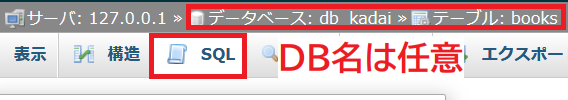

<link href="https://use.fontawesome.com/releases/v5.0.6/css/all.css" rel="stylesheet">
<style>
  a::after {
    padding: 0 4px;
    content: "\f35d";
    font-family: "Font Awesome 5 Free";
    font-weight: 900;
    font-size: 0.8rem;
  }
  @media print {
    @page { margin: 0; }
    body { margin: 1.6cm; }
  }
  h2 {
    border-left: solid 6px #28a745;
    border-bottom: none!important;
    padding-left: 16px;
    height: 40px!important;
    line-height: 40px!important;
    font-weight: bold!important;
  }
  h3 {
    padding-left: -14px;
    border-bottom: dashed #ccc 1px;
  }
  h3:before {
    content: "■ ";
    color: #17a2b8;
  }
  th, td {
    border: solid 1px #666;
  }
  table {
    margin-bottom: 30px;
  }
  strong {
    color: #f66;
  }
  hr {
    margin-bottom: 30px;
    border-color: #ccc;
  }
  blockquote {
    background: none!important;
    /* font-style: italic; */
    color: #999;
  }
</style>

# SQL チュートリアル - SELECT 文

## 導入

SQL とは Structured Query Language の略で、データベースの操作を行うための言語である。
データベースごとに独自の拡張を加えた SQL が使われているが、基本的な SQL は共通している。本研修では MySQL を使用するが、他のデータベースでも利用できる基本的な SQL について解説していく。

### SELECT 文

DB に対して検索を行い、データを抽出する SQL が SELECT 文である。
CRUD（クラッド）の R（Read）に当たる操作であり、最も使用頻度が高い。
本資料内では基本的な SELECT 文についてチュートリアルを行い、発展的な SELECT 文とその他のデータ操作については別の資料で触れる。

なお、CRUD とは DB と連携するアプリケーションの持つ基本機能の頭文字を並べたもので、SQL との対応は以下の表のようになっている。
|基本機能|SQL|操作|
|---|---|---|
|Create|INSERT|追加（生成）|
|Read|SELECT|検索（読取）|
|Update|UPDATE|更新|
|Delete|DELETE|削除|

## チュートリアル用のテーブル作成

以下のテーブルを作成する。以降のチュートリアルでは特に記述がない限りこのテーブルに対して SQL を発行していく。
DB については任意の DB 名で別紙の phpMyAdmin の資料で説明した通りに作成していれば問題ない。

### books テーブル

title_id にプライマリーキーとオートインクリメントを 設定する

| カラム名 | 意味        | 型          | NULL |
| -------- | ----------- | ----------- | ---- |
| title_id | タイトル ID | INT(11)     | ×    |
| title    | タイトル    | VARCHAR(32) | ×    |
| size     | 判型        | VARCHAR(4)  | ×    |
| pages    | ページ数    | INT(11)     | ×    |
| note     | 備考        | VARCHAR(64) | ○    |

#### データ入力

データ入力の手間を省くため、チュートリアル用データ追加の SQL 文を以下に示す。
books テーブルの SQL 入力画面に移動して実行すること（画像参照）。  


```sql
INSERT INTO `books` (`title_id`, `title`, `size`, `pages`, `note`) VALUES
(1, '新クトゥルフ神話TRPG スターターセット', 'B5', 160, '第7版'),
(2, 'シノビガミ 基本ルールブック', 'B5', 256, NULL),
(3, 'ソード・ワールド2.5 ルールブックI', '文庫', 480, NULL),
(4, 'インセイン 基本ルールブック', '新書', 288, NULL),
(5, '銀剣のステラナイツ', '新書', 352, NULL),
(6, 'パグマイア 基本ルールブック', 'B5', 240, NULL),
(7, '永い後日談のネクロニカ', 'B5', 208, NULL),
(8, 'カオスフレア Second Chapter', 'B5', 278, NULL),
(9, 'パラノイア【トラブルシューターズ】', 'A4', 208, '基本ルールブック'),
(10, 'ダブルクロス The 3rd Edition ルールブック1', '文庫', 382, NULL),
(11, 'モノトーンミュージアム', 'A5', 271, NULL),
(12, 'ゆうやけこやけ', 'B5', 164, NULL),
(13, '新クトゥルフ神話TRPG ルールブック', 'B5', 432, '第7版基本ルールブック')
(14, 'ビーストバインドトリニティ', 'B5', 287, '第3版基本ルールブック');
```

## 基本的な SELECT 文

### 書式

```sql
SELECT ［カラム名, カラム名, ...］ FROM ［テーブル名］ ［検索条件］
```

上記の括弧内を適宜書き換えていく。

### 全件取得

カラム名を「\*（アスタリスク）」にすると、すべてのカラムが指定される。
下記 SQL を実行すると books テーブルから全件取得する。

```sql
SELECT * FROM books
```

実行結果

### カラム名を指定して取得

カラム名を指定すると、指定したカラムのみかつ指定した順番にデータが取得される。

```sql
SELECT pages, title FROM books
```

実行結果

## 条件付きの SELECT 文

WHERE 句を追加することで、検索条件を指定することができる。

### 基本的な比較演算子

以下の SQL を実行すると、pages（ページ数）が 200 ページよりも小さいレコードを取得し、title を表示する。

```sql
SELECT title FROM books WHERE pages < 200
```

実行結果

基本的な比較演算子

| 演算子 | 意味       |
| ------ | ---------- |
| =      | 等しい     |
| <      | より小さい |
| \>     | より大きい |
| <=     | 以下       |
| >=     | 以上       |
| <>     | 等しくない |

### AND、OR

条件を AND や OR でつなげることで複数条件の検索ができる。

- AND：複数の条件がいずれも成り立つ場合
- OR：複数の条件のうちいずれかが成り立つ場合

いくつか例を示す。

#### ページ数が 200 以上かつ 300 未満

```sql
SELECT * FROM books WHERE pages >= 200 AND pages < 300
```

実行結果

#### 判型が新書サイズあるいはページ数が 400 以上

```sql
SELECT * FROM books WHERE size = '新書' OR pages >= 400
```

実行結果

#### 条件 3 つ
条件文には括弧も使うことができる

- ページ数が 250 以上かつ 350 未満
- あるいは判型が B5 サイズ

```sql
SELECT * FROM books WHERE (pages >= 250 AND pages < 350) OR size = 'B5'
```

実行結果

### BETWEEN、IN


### LIKE

### 結果のフィルタとソート

1. select 文
   1. カラム指定して取得
   1. すべての情報を取得
   1. WHERE
   1. 比較演算子
   1. AND、OR
   1. BETWEEN、IN
   1. LIKE
   1. 結果のフィルタ・ソート
1. select 文振り返り問題
1. テーブルの結合
   1. LEFT JOIN
   1. RIGHT JOIN
   1. FULL JOIN
   1. NULL
1. insert 文
1. update 文
1. delete 文
