<link href="https://use.fontawesome.com/releases/v5.0.6/css/all.css" rel="stylesheet">
<style>
  a::after {
    padding: 0 4px;
    content: "\f35d";
    font-family: "Font Awesome 5 Free";
    font-weight: 900;
    font-size: 0.8rem;
  }
  @media print {
    @page { margin: 0; }
    body { margin: 1.6cm; }
  }
  h2 {
    border-left: solid 6px #28a745;
    border-bottom: none!important;
    padding-left: 16px;
    height: 40px!important;
    line-height: 40px!important;
    font-weight: bold!important;
  }
  h3 {
    padding-left: -14px;
    border-bottom: dashed #ccc 1px;
  }
  h3:before {
    content: "■ ";
    color: #17a2b8;
  }
  th, td {
    border: solid 1px #666;
  }
  table {
    margin-bottom: 30px;
  }
  strong {
    color: #f66;
  }
  hr {
    margin-bottom: 30px;
    border-color: #ccc;
  }
  blockquote {
    background: none!important;
    /* font-style: italic; */
    color: #999;
  }
</style>

# SQL チュートリアル - 発展

## チュートリアル用のテーブル作成

新たにテーブルを 2 つ用意する。  
なお、基礎のチュートリアルで作成した books テーブルはこのチュートリアルでも引き続き使用する。

### depts テーブル

dept_id にプライマリーキーとオートインクリメントを設定する。

| カラム名 | 意味    | 型          | NULL |
| -------- | ------- | ----------- | ---- |
| dept_id  | 部署 ID | INT         | ×    |
| name     | 部署名  | VARCHAR(32) | ×    |

#### データ入力

| name   |
| ------ |
| 営業部 |
| 総務部 |
| 技術部 |

### employees テーブル

id にプライマリキーとオートインクリメントを設定する。

| カラム名 | 意味              | 型          | NULL |
| -------- | ----------------- | ----------- | ---- |
| id       | 社員 ID           | INT         | ×    |
| name     | 社員名            | VARCHAR(32) | ×    |
| dept_id  | 所属部署の部署 ID | INT         | ○    |

#### データ入力

| name    | dept_id |
| ------- | ------- |
| Alpha   | 1       |
| Bravo   | 2       |
| Charlie | 1       |
| Delta   | _NULL_  |

<div class="page">

## テーブルの結合

複数のテーブルを結合し、結合後のテーブルから SELECT 文でデータを抽出することができる。結合方法には大きく分けて内部結合と外部結合がある。  
<br>
この項では作成しておいた deps テーブルと employee テーブルを使って説明する。  
これらのテーブルのポイントは以下の 2 点である。

- 技術部（dept_id=3）所属は存在しない
- Delta はどの部署にも所属していない（NULL）

### 内部結合

INNER JOIN 句を使うと内部結合が行える。  
内部結合は指定したカラムに対して、同じデータを持つレコード同士を結合させる。指定したカラムのデータがどちらかにしかない（同じデータがない）レコードは抽出されない。  
INNER JOIN 句は「INNER」 を省略して「JOIN」とだけ書くこともできる。

#### 書式

```sql
SELECT 〈カラム名...〉 FROM 〈テーブル名1〉 [INNER] JOIN 〈テーブル名2〉
ON 〈テーブル名1〉.〈指定カラム名1〉 = 〈テーブル名2〉.〈指定カラム名2〉
```

指定するカラム名はどちらのテーブルでも同じ名前にしておくと分かりやすい。

<div class="page">

以下に例を示す。

```sql
SELECT * FROM employees INNER JOIN depts
ON employees.dept_id = depts.dept_id
```

この SQL は、employees テーブルに対し、「employees（社員） テーブルの dept_id と dept_id が同じ depts（部署） テーブルのレコードを結合する」という意味である。  
<br>
以下にそれぞれのテーブルと実行結果を示す。

| employees                                  | depts                                  | 実行結果                                   |
| ------------------------------------------ | -------------------------------------- | ------------------------------------------ |
| 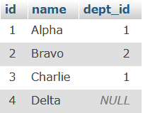 | 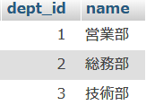 | 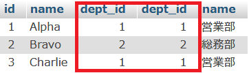 |

前述したとおり、dept_id が NULL の「Delta」と所属する employee が存在しない「技術部」は抽出されていない。

#### WHERE 句を使う方法

INNER JOIN 句を使わず、以下のように WHERE 句を使って内部結合を行うこともできる。

```sql
SELECT * FROM employees, depts
WHERE employees.dept_id = depts.depts_id
```

<div class="page">

### 外部結合

外部結合の場合、内部結合と違い、どちらかのテーブルにしか存在しないレコードも取得する。  
外部結合には以下の 2 つがある。

- LEFT OUTER JOIN：左側のテーブルの内容を全て抽出する
- RIGHT OUTER JOIN：右側のテーブルの内容を全て抽出する

左側、右側というのは JOIN 句を中心として見た SQL 文上の左右を意味する。  
なお、「OUTER」は省略できる。

以下に例を示す。

#### LEFT JOIN

```sql
SELECT * FROM employees LEFT JOIN depts
ON employees.dept_id = depts.dept_id
```

実行結果  
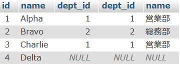

「Delta」が抽出されており、「技術部」は抽出されていない。

#### RIGHT JOIN

```sql
SELECT * FROM employees RIGHT JOIN depts
ON employees.dept_id = depts.dept_id
```

実行結果  
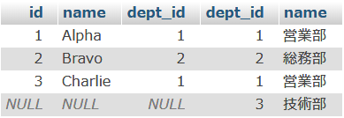

「技術部」が抽出されており、「Delta」は抽出されていない。

<div class="page">

### USING

結合を行う際、結合条件として指定するカラム名がそれぞれのテーブルで同じ場合、USING 句を使って書くこともできる。  
以下の 2 つの SQL は同じ意味である。

```sql
SELECT * FROM employees JOIN depts USING(dept_id)
SELECT * FROM employees JOIN depts ON employees.dept_id = depts.dept_id
```

## 集計関数

集計関数を使うことで演算を行うことができる。  
<br>
集計関数一覧  
|関数名|機能|
|---|---|
|MAX|最大値|
|MIN|最小値|
|SUM|合計|
|AVG|平均値|
|COUNT|個数のカウント|

「`集計関数（カラム名）`」のように書いて使用する。  
<br>
以下に例を示す。

#### ページ数（pages）の平均を表示する

```sql
SELECT AVG(pages) FROM books
```

実行結果  
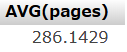

#### ページ数の最大値と最小値を表示する

```sql
SELECT MAX(pages), MIN(pages) FROM books
```

<div class="page">

## GROUP BY

GROUP BY 句でカラム名を指定すると、指定したカラムの値が同じデータをグループとしてまとめて扱う。  
グループ化した場合、抽出される単位もグループ単位となる。

以下に例を示す。

#### 判型（size）でグループ化

```sql
SELECT * FROM books GROUP BY size
```

実行結果  
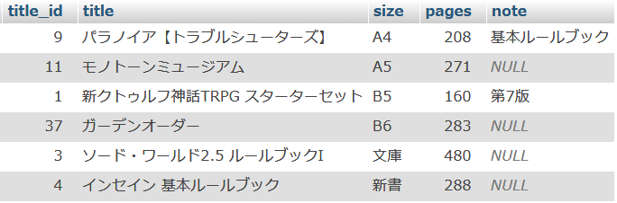
それぞれの判型で title_id が最も小さいフィールドのみ抽出されている。  
通常はこの例のように全カラムの抽出は行わず、以下のようにカテゴリごとに何らかの集計を行いたい場合に GROUP BY 句を使うことが多い。

#### 判型ごとの冊数とページ数平均を表示

```sql
SELECT size, COUNT(size), AVG(pages) FROM books GROUP BY size
```

実行結果  
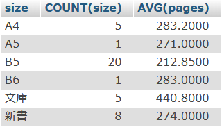

<div class="page">

## AS

AS 句を使うことでカラムやテーブルに別名を付けることができる。

```sql
〈元の名前〉 AS 〈別名〉
```

AS 句は省略して以下のように書ける。

```sql
〈元の名前〉〈空白〉〈別名〉
```

<br>
以下に例を示す。

#### テーブルに別名を付ける

depts テーブルに d、employee テーブルに e という別名を付けている。

```sql
SELECT e.name, d.name FROM employees AS e
INNER JOIN depts AS d ON e.dept_id = d.dept_id
```

実行結果  
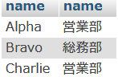

#### 判型ごとの冊数とページ数平均を表示（カラム名設定）

```sql
SELECT size '判型', COUNT(size) '冊数', AVG(pages) 'ページ数の平均'
FROM books GROUP BY size
```

実行結果  
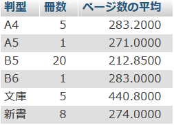

<div class="page">

## HAVING

HAVING 句は WHERE 句と同じく検索条件を指定する SQL である。  
WHERE 句との違いは SQL 文中での評価順序である。  
以下に SELECT 文における各句の評価順序を示す。

1. FROM
1. ON
1. JOIN
1. **WHERE**
1. GROUP BY
1. **HAVING**
1. SELECT
1. DISTINCT
1. ORDER BY
1. LIMIT

GROUP BY 句の前か後かという点で異なる。

- WHERE:グループ化される前に条件を適用
- HAVING:グループ化された後に条件を適用

HAVING 句の場合、集計関数と併用されることが多い。
以下に例を示す。

#### 5 冊以上登録されている判型を抽出

```sql
SELECT size, COUNT(size) FROM books GROUP BY size HAVING COUNT(size) >= 5
```

実行結果  
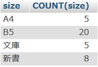

<div class="page">

## サブクエリ

サブクエリとは、あるクエリの中に含まれるもう一つのクエリである。  
何度かクエリを実行しないと得られない結果を一度で得たいときに使われる。
<br>
サブクエリで抽出した結果をメインのクエリの検索条件とする例を以下に示す。

```sql
SELECT name FROM employees
WHERE dept_id = (SELECT dept_id FROM depts where name like '営業%')
```

実行結果  
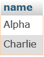

「営業」から始まる部署に所属する社員が抽出される。  
外側の WHERE の条件が「=」のため、サブクエリの結果が 2 行以上の場合はエラーになる。  
以上以下など、条件が範囲をとる場合はエラーにはならない。  
<br>
なお、上記の例は結合（JOIN 句）を使って書くこともできる。

```sql
SELECT employees.name FROM employees JOIN depts
ON employees.dept_id = depts.dept_id
WHERE depts.name like '営業%'
```

<div class="page">

## INSERT 文

DB に対して新たなレコードを挿入（追加）する SQL が INSERT 文である。  
基本的な構文は以下の通り（長くなったため改行）。  
値を NULL や空文字にした場合はそのカラムのデフォルト値が入力される。

```sql
INSERT INTO 〈テーブル名〉 (〈カラム名〉,〈カラム名〉...〉)
VALUES (〈値〉,〈値〉...)
```

例として books テーブルに追加するクエリを以下に示す。  
`title_id`にはオートインクリメントを設定しているため、NULL にしておけば自動的に連番が割振られる。

```sql
INSERT INTO books (title_id, title, size, pages, note)
VALUES (NULL, '歯車の塔の探空士', 'B5', 68, '同人')
```

## UPDATE 文

DB に保存されているレコードを更新する SQL が UPDATE 文である。  
基本的な構文は以下の通り（長くなったため改行）。

```sql
UPDATE 〈テーブル名〉 SET 〈カラム名〉=〈値〉, 〈カラム名〉=〈値〉...
WHERE 〈条件〉
```

例として employees テーブルの Delta（id=4）の部署 ID（dept_id）を技術部（dept_id=3）に更新する。

```sql
UPDATE employees SET dept_id = 3 WHERE id = 4
```

<div class="page">

## DELETE 文

DB に保存されているレコードを削除する SQL が DELETE 文である。  
基本的な構文は以下の通り。

```sql
DELETE FROM 〈テーブル名〉 WHERE 〈条件〉
```

ID で指定する方法は UPDATE 文で例示した方法と同様にできるため、books テーブルから判型（size）が B5 サイズのレコードを削除する例を以下に示す。

```sql
DELETE FROM books WHERE size = 'B5'
```
