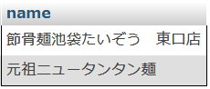

<link href="https://use.fontawesome.com/releases/v5.0.6/css/all.css" rel="stylesheet">
<style>
  a::after {
    padding: 0 4px;
    content: "\f35d";
    font-family: "Font Awesome 5 Free";
    font-weight: 900;
    font-size: 0.8rem;
  }
  @media print {
    @page { margin: 0; }
    body { margin: 1.6cm; }
  }
  h2 {
    border-left: solid 6px #28a745;
    border-bottom: none!important;
    padding-left: 16px;
    height: 40px!important;
    line-height: 40px!important;
    font-weight: bold!important;
  }
  h3 {
    padding-left: -14px;
    border-bottom: dashed #ccc 1px;
  }
  h3:before {
    content: "■ ";
    color: #17a2b8;
  }
  th, td {
    border: solid 1px #666;
  }
  table {
    margin-bottom: 30px;
  }
  strong {
    color: #f66;
  }
  hr {
    margin-bottom: 30px;
    border-color: #ccc;
  }
  blockquote {
    background: none!important;
    /* font-style: italic; */
    color: #999;
  }
</style>

# SQL 課題

## 課題用のテーブル作成

筆者が過去に研修課題で作成したシステムのテーブルの一部を使用する。  
任意の DB で以下の SQL を実行する。

```sql
SET SQL_MODE = "NO_AUTO_VALUE_ON_ZERO";
SET AUTOCOMMIT = 0;
START TRANSACTION;
SET time_zone = "+00:00";

CREATE TABLE `genre` (
  `id` int(11) NOT NULL,
  `name` varchar(15) COLLATE utf8_unicode_ci NOT NULL,
  `group_id` int(11) NOT NULL
) ENGINE=InnoDB DEFAULT CHARSET=utf8 COLLATE=utf8_unicode_ci;

INSERT INTO `genre` (`id`, `name`, `group_id`) VALUES
(1, '豚骨', 1),(2, '醤油', 1),(3, '味噌', 1),(4, '塩', 1),(5, '魚介出汁', 1),(6, '魚介豚骨', 1),(7, '辛い', 1),(8, 'こってり', 1),(9, 'さっぱり', 1),(10, '海鮮・魚介', 2),(11, 'うどん・そば', 2),(12, 'とんかつ', 2),(13, '天ぷら', 2),(14, '鉄板焼き', 2),(15, '焼き肉', 2),(16, 'お好み焼き', 2),(17, '鍋', 2),(18, 'その他（和食）', 2),(19, 'カレー', 3),(20, 'ステーキ', 3),(21, 'ハンバーグ', 3),(22, 'パスタ', 3),(23, 'イタリアン', 3),(24, 'シーフード', 3),(25, 'ピザ', 3),(26, 'その他（洋食）', 3),(27, '餃子', 4),(28, '中華', 4),(29, '韓国', 4),(30, 'エスニック', 4),(31, 'おかわり無料', 5),(32, '大盛り無料', 5);

CREATE TABLE `genre_group` (
  `id` int(11) NOT NULL,
  `name` varchar(15) COLLATE utf8_unicode_ci NOT NULL
) ENGINE=InnoDB DEFAULT CHARSET=utf8 COLLATE=utf8_unicode_ci;
INSERT INTO `genre_group` (`id`, `name`) VALUES
(1, 'ラーメン'),(2, '和食'),(3, '洋食'),(4, 'その他の料理'),(5, '無料サービス');

CREATE TABLE `genre_of_restaurant` (
  `restaurant_id` int(11) NOT NULL,
  `genre_id` int(11) NOT NULL
) ENGINE=InnoDB DEFAULT CHARSET=utf8 COLLATE=utf8_unicode_ci;
INSERT INTO `genre_of_restaurant` (`restaurant_id`, `genre_id`) VALUES
(2, 20),(2, 21),(2, 31),(3, 10),(3, 12),(3, 17),(3, 18),(3, 21),(4, 7),(4, 8),(5, 18),(6, 1),(6, 2),(6, 27),(7, 18),(7, 31),(8, 2),(8, 27),(8, 28),(9, 1),(9, 7),(9, 8),(9, 27),(10, 12),(10, 19),(10, 31),(11, 18),(12, 1),(12, 8),(12, 31),(13, 2),(13, 7),(13, 27),(13, 28),(13, 31),(14, 15),(14, 29),(14, 31),(15, 19),(15, 30),(16, 18),(17, 1),(17, 18),(17, 20),(17, 21),(17, 31),(18, 21),(1, 10),(1, 11),(1, 12),(1, 13),(1, 14),(1, 15),(1, 16),(1, 17),(1, 18),(1, 27),(19, 10),(19, 11),(19, 15),(19, 16),(20, 1),(20, 6),(20, 7),(20, 8),(20, 32);
```

<div class="page">

```sql
CREATE TABLE `restaurant` (
  `id` int(11) NOT NULL,
  `name` varchar(30) COLLATE utf8_unicode_ci NOT NULL,
  `lat` double(8,6) NOT NULL,
  `lng` double(9,6) NOT NULL,
  `distance` int(5) NOT NULL,
  `time` int(2) NOT NULL,
  `use_count` int(3) NOT NULL
) ENGINE=InnoDB DEFAULT CHARSET=utf8 COLLATE=utf8_unicode_ci;
INSERT INTO `restaurant` (`id`, `name`, `lat`, `lng`, `distance`, `time`, `use_count`) VALUES
(1, '節骨麺池袋たいぞう　東口店', 35.731540, 139.713604, 301, 6, 3),
(2, 'ペッパーランチ池袋東口店', 35.732880, 139.715895, 92, 2, 2),
(3, '築地食堂源ちゃん　東池袋店', 35.733249, 139.715313, 57, 1, 1),
(4, '元祖ニュータンタン麺', 35.732831, 139.714419, 146, 3, 1),
(5, 'たどん　池袋店', 35.732435, 139.712998, 276, 5, 1),
(6, '餃子の王将　池袋東口店', 35.728394, 139.713580, 618, 11, 1),
(7, '万事快調', 35.733449, 139.715566, 27, 1, 1),
(8, '福しん', 35.732971, 139.715495, 80, 2, 2),
(9, '鶏の穴', 35.732618, 139.714696, 146, 3, 1),
(10, '松のや　東池袋店', 35.732082, 139.713854, 241, 5, 1),
(11, 'とり鉄　東池袋店', 35.731175, 139.715203, 282, 5, 1),
(12, 'とんこつラーメン博多風龍　池袋東口店', 35.731869, 139.714358, 233, 4, 1),
(13, '楽楽', 35.731238, 139.714407, 294, 5, 1),
(14, '焼肉専門店　牛菜', 35.731106, 139.715199, 290, 5, 1),
(15, 'サグーン Sagun', 35.732643, 139.713430, 231, 4, 2),
(16, '吉野家　池袋東口店', 35.731812, 139.713950, 258, 5, 1),
(17, '情熱のすためしどん　池袋東口LABI横店', 35.731750, 139.713888, 267, 5, 2),
(18, 'モスバーガー 池袋東店', 35.732814, 139.715817, 98, 2, 1),
(19, 'テスト', 35.731942, 139.715482, 194, 4, 1),
(20, '俺の空 池袋店', 35.732177, 139.716148, 174, 3, 2);

ALTER TABLE `genre`
  ADD PRIMARY KEY (`id`);
ALTER TABLE `genre_group`
  ADD PRIMARY KEY (`id`);
ALTER TABLE `restaurant`
  ADD PRIMARY KEY (`id`);

ALTER TABLE `genre`
  MODIFY `id` int(11) NOT NULL AUTO_INCREMENT, AUTO_INCREMENT=33;
ALTER TABLE `genre_group`
  MODIFY `id` int(11) NOT NULL AUTO_INCREMENT, AUTO_INCREMENT=6;
ALTER TABLE `restaurant`
  MODIFY `id` int(11) NOT NULL AUTO_INCREMENT, AUTO_INCREMENT=22;
COMMIT;
```

<div class="page">

## テーブル定義

### 飲食店マスタ

表名：restaurant
|列名<br>（論理）|列名<br>（物理）|データ型|長さ|必須|主キー|備考|
|-|-|-|-|-|-|-|
|飲食店 ID|id|INT|11|Yes|○||
|飲食店名|name|VARCHAR|30|Yes|||
|緯度|lat|DOUBLE|8,6|Yes|||
|経度|lng|DOUBLE|9,6|Yes|||
|距離|distance|INT|5|Yes||単位：メートル|
|所要時間|time|INT|2|Yes||単位：分|
|利用回数|use_count|INT|3|Yes|||

※time は SQL の予約語と被っているため、あまりよくない名前

### ジャンルマスタ

表名：genre
|列名<br>（論理）|列名<br>（物理）|データ型|長さ|必須|主キー|備考|
|-|-|-|-|-|-|-|
|ジャンル ID|id|INT|11|Yes|○||
|ジャンル名|name|VARCHAR|15|Yes|||
|所属グループ|group_id|11|Yes||||

### グループマスタ

表名：genre_group
|列名<br>（論理）|列名<br>（物理）|データ型|長さ|必須|主キー|備考|
|-|-|-|-|-|-|-|
|グループ ID|id|INT|11|Yes|○|||
|グループ名|name|VARCHAR|15|Yes||||

<div class="page">

### 飲食店のジャンル

表名：genre_of_restaurant
|列名<br>（論理）|列名<br>（物理）|データ型|長さ|必須|主キー|備考|
|-|-|-|-|-|-|-|
|中間テーブル ID|id|INT|11|Yes|○||||
|飲食店 ID|restaurant_id|INT|11|Yes|||||
|ジャンル ID|genre_id|INT|11|Yes|||||

### 用語の補足

#### ジャンル

その飲食店で扱っているメニューのジャンル。  
ジャンルは必ずひとつのグループに所属する。  
ひとつの飲食店はひとつ以上のジャンルを持つ。  
（ジャンルの例：ラーメン、和食、肉料理、こってり、辛い）

#### グループ

共通する要素を持つジャンルをまとめたもの。  
ジャンルの親要素にあたる。

<div class="page">

## 課題

各課題は問題文実と正答実行時の結果画像の組み合わせで示す。  
問題文においてカラム名が特に指定されていない場合、原則として実行結果と同じカラムを取得することとする。  

### 1.基本

#### 1-1.カラム名を記述せずに各飲食店のすべての情報を取得せよ

実行結果省略

#### 1-2.各飲食店の飲食店名、距離、所要時間を取得せよ

実行結果  


<div class="page">

### 2.単純な検索

#### 2-1.飲食店 ID が 14 の飲食店を取得せよ

実行結果  


#### 2-2.距離が 100m 以内の飲食店を取得せよ

実行結果  


#### 2-3.距離が 100m 以上 200m 以下の飲食店を BETWEEN 句を使って取得せよ

実行結果  


#### 2-4.距離が 3 番目と 4 番目に遠い飲食店を取得せよ

実行結果  


<div class="page">

#### 2-5.飲食店名に「麺」が含まれる飲食店を取得せよ

実行結果  


#### 2-6.飲食店名が「店」で終わる飲食店を取得せよ

実行結果  


#### 2-7.GROUP BY 以外の方法で、ジャンルに紐付いているすべてのジャンル ID を重複を省いて取得せよ

実行結果  


<div class="page">

### 3.結合

#### 3-1.ジャンルとグループの組み合わせをすべて取得せよ

実行結果  


#### 3-2.どの飲食店にも設定されていないジャンルを取得せよ

実行結果  


<div class="page">

#### 3-3.飲食店 ID が 8 の飲食店に付けられているジャンルを重複を省いてすべて取得せよ

実行結果  


#### 3-4.「おかわり無料」のジャンルが設定されている飲食店で、最も近い飲食店を取得せよ

実行結果  


#### 3-5.「豚骨」ジャンルが設定されている飲食店の数をカラムに別名を付けて取得せよ

実行結果  


#### 3-6.ジャンル ID が 1 か 8 いずれかが設定された飲食店を重複を省いて取得せよ

実行結果  


<div class="page">

#### 3-7.ジャンル ID が 1 と 8 いずれも設定された飲食店を取得せよ

ヒント

- テーブル構造上、1 レコードにジャンル ID は複数紐付かない。
- 課題 3-6 で重複を省かなかった場合のレコードの数に注目。

実行結果  


#### 3-8.ジャンル ID が 1 か 8 いずれかが設定された飲食店を“除いた”飲食店を取得せよ

ヒント

- 単にジャンル ID を NOT IN するだけでは設定されたジャンル ID が（1、10）のような飲食店を除外できない。
- サブクエリを使用する。

実行結果  

