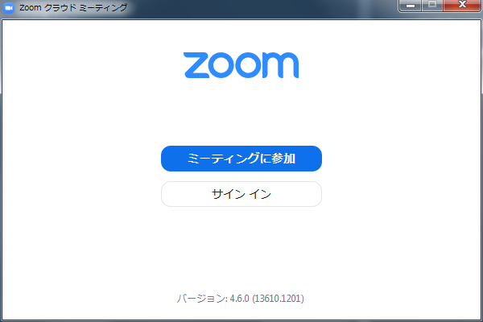

<link href="https://use.fontawesome.com/releases/v5.0.6/css/all.css" rel="stylesheet">

# Zoom インストールから通話接続まで

## Zoom とは

> リアルタイムメッセージングとコンテンツ共有が可能な企業向けビデオ会議。
>
> ※[公式サイト](https://zoom.us/) より引用。

つまり、ビデオ通話とチャット機能が備わったアプリケーションである。

 

 

## Zoom の ダウンロード と インストール

### ダウンロード

[ダウンロードページ](https://zoom.us/download#client_4meeting) から

「ミーティング用Zoomクライアント」をダウンロードする。

※ファイル名: `ZoomInstaller.exe`

### インストール

ダウンロードしたファイルを実行し、インストールを進める。

インストールの際、特に選択するような項目はなく

以下の画面が表示されたならば無事インストールは完了。

 

 

## ビデオ通話をするためには

ホストがビデオ通話用の部屋を建て

その通話部屋への招待 URL をゲストへ連絡。

ゲスト側は招待 URL を開くことにより、通話への参加が可能である。

つまり、皆さんは招待 URL を待つだけで大丈夫です。
